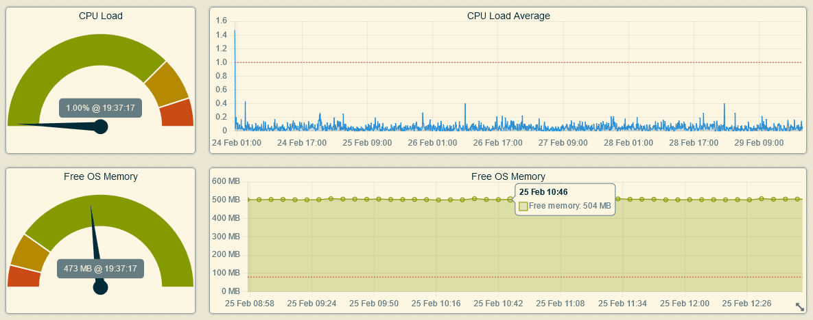

# Hub-a-Dashery

View dashboards for your Hubitat hub metrics.

## Installation

To install the Hub-a-Dashery app using the Hubitat Package Manager (and receive automatic updates), follow these steps:

1. Go to the **Apps** menu in the Hubitat interface.
2. Select **Hubitat Package Manager** from the list of apps.
3. Click **Install** and then **Search by Keywords**.
4. Type **Hub-a-Dashery** in the search box and click **Next**.
5. Choose **Hub-a-Dashery by Dan Danache** and click **Next**.
6. Read the license agreement and click **Next**.
7. Wait for the installation to complete and click **Next**.
8. Go back to the **Apps** menu in the Hubitat interface.
9. Click the **Add user app** button in the top right corner.
10. Select **Hub-a-Dashery** from the list of apps.

## Usage

To use the Hub-a-Dashery app, follow these steps:

1. Go to the **Apps** menu in the Hubitat interface.
2. Select **Hub-a-Dashery** from the list of apps.

## Available dashboards

The app provides various dashboards to monitor the Hub's performance and status. Currently, the following dashboards are available:

## Memory and CPU history dashboard

This dashboard shows the free memory (RAM) and the processor [load average](https://phoenixnap.com/kb/linux-average-load) of the Hub over time. You can access the data source at `http://hubitat.local/hub/advanced/freeOSMemoryHistory`.

**Note**: The data is reset after each Hub reboot and is not available for the first 15 minutes.

### Dashboard features

- The dashboard adapts to the window size and orientation.
- You can zoom in and out with the mouse wheel or the pinch gesture on mobile devices.
- You can drag the graphs left or right to see different time periods.
- You can switch between light and dark modes from the app settings.

---

