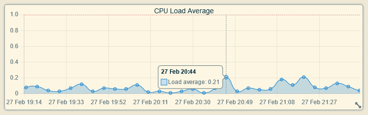
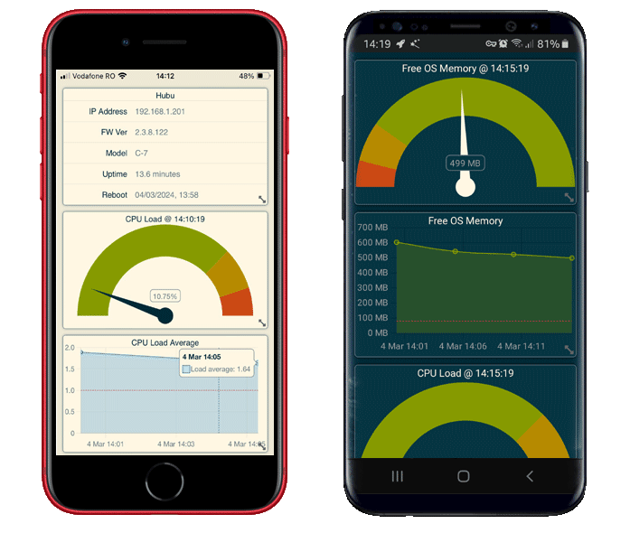
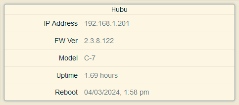
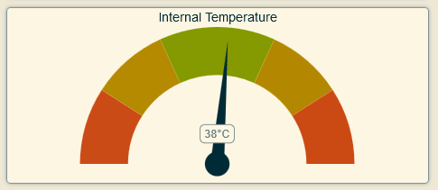

# Hub-a-Dashery

View dashboards for your Hubitat hub metrics.

## Installation

To install the Hub-a-Dashery app using the Hubitat Package Manager (and receive automatic updates), follow these steps:

1. Go to the **Apps** menu in the Hubitat interface.
2. Select **Hubitat Package Manager** from the list of apps.
3. Click **Install** and then **Search by Keywords**.
4. Type **Hub-a-Dashery** in the search box and click **Next**.
5. Choose **Hub-a-Dashery by Dan Danache** and click **Next**.
6. Read the license agreement and click **Next**.
7. Wait for the installation to complete and click **Next**.
8. Go back to the **Apps** menu in the Hubitat interface.
9. Click the **Add user app** button in the top right corner.
10. Select **Hub-a-Dashery** from the list of apps.

## Usage

To use the Hub-a-Dashery app, follow these steps:

1. Go to the **Apps** menu in the Hubitat interface.
2. Select **Hub-a-Dashery** from the list of apps.

## Features

### Dark Theme Support
The dark theme reduces the luminance emitted by device screens, while still meeting minimum color contrast ratios. It helps improve visual ergonomics by reducing eye strain and facilitating screen use in dark environments – all while conserving battery power.

You can enable/disable the dark theme from the Hubitat app:

### Dashboard Grid Layout
The app provides a flexible and user-friendly dashboard grid layout that empowers you to customize your dashboard experience. With this feature, you can effortlessly rearrange charts, widgets, and other visual elements to suit your preferences.

When you’ve achieved the ideal arrangement, press **Ctrl + S** to save the current grid layout.

### Zoom and Pan
You can use the zoom and pan functionality for charts that display multiple data points over time.

#### Zooming In and Out
- To **zoom in**, use the mouse wheel (scroll up) or perform a pinch gesture on mobile devices. This action magnifies the chart, allowing you to focus on specific data points or intervals.
- Conversely, to **zoom out**, scroll the mouse wheel down or reverse the pinch gesture. Zooming out provides a broader view of the chart, encompassing a larger time range or dataset.

#### Panning (Horizontal Movement)
Panning allows you to explore different time periods within the same chart. Here’s how it works:

- **Left Panning**: Drag the chart to the left (by clicking and holding while moving the cursor left). This exposes later data points or shifts the view to the future.

- **Right Panning**: Drag the chart to the right (similarly, click and hold while moving the cursor right). This reveals earlier data points or shifts the view to the past.

These interactive features enhance your ability to analyze data dynamically. Feel free to experiment with zooming and panning to uncover insights hidden within your charts!

### Progressive Web App Support
Hub-a-Dashery can be easily installed as a Progressive Web App (PWA). PWAs offer a seamless experience by allowing users to install web apps directly on their devices. Let’s walk through the installation steps:

#### For Desktop/Laptop and Android users:
1. Open your preferred browser (such as Chrome or Edge). Most modern browsers, including Google Chrome, Microsoft Edge, and Samsung Internet, are compatible with PWAs.
1. Navigate to the Hub-a-Dashery HTML app, starting from the Hubitat Hub interface.
1. Once on the Hub-a-Dashery HTML app, tap the **Install** button. This action prompts the browser to recognize Hub-a-Dashery as a PWA.
1. Follow the on-screen instructions to complete the installation process.
1. Hub-a-Dashery will now appear as an app icon on your device, alongside other platform-specific apps.

#### For iOS users:
1. Open Safari on your iOS device.
1. Navigate to the Hub-a-Dashery HTML app, starting from the Hubitat Hub interface.
1. Once on the Hub-a-Dashery HTML app, tap the Share button (usually represented by a square with an arrow pointing upward).
1. Select **Add to Home Screen** from the options.
1. Customize the app name (if desired) and tap Add.
1. Hub-a-Dashery will now be accessible from your home screen like any other app.

Once installed, you can launch Hub-a-Dashery directly from your device and it will behave like a native app, providing a seamless experience.

## Dashboard Widgets

The app provides various widgets to monitor the Hub's performance and status. Currently, the following dashboards widgets are available:

### Memory and CPU Information

These 4 widgets show the OS free memory (RAM) and the processor [load average](https://phoenixnap.com/kb/linux-average-load) of the Hub over time and in the last 15 minutes.

Refresh time: 1 min

You can access the data source at:
- `http://hubitat.local/hub/advanced/freeOSMemoryHistory`
- `http://hubitat.local/hub/advanced/hub/advanced/freeOSMemoryLast`

**Note**: The history data is reset after each Hub reboot and this data is not available for the first 15 minutes.

### Hub Information

This simple table widget shows information about your Hubitat hub.

Refresh time: 5 min

### Internal Temperature

This widget shows the current internal temperature of the Hub. Temperature is shown in Celsius or Fahrenheit according to your Hub settings.

Refresh time: 1 min

---

