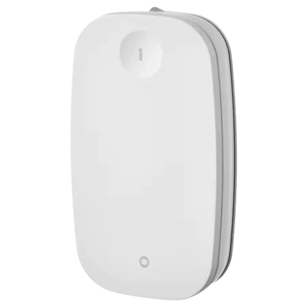
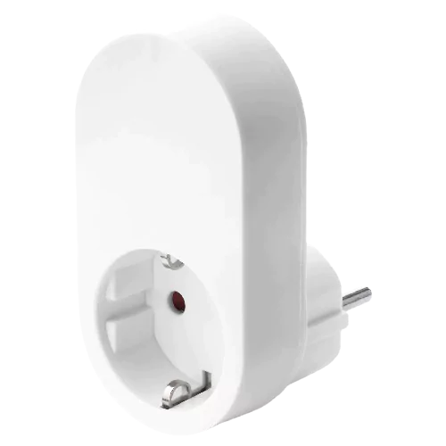

# IKEA Zigbee drivers

Supported devices:
* [Askvader On/Off Switch (E1836)](#askvader-onoff-switch-e1836)
* [Parasoll Door/Window Sensor (E2013)](#parasoll-doorwindow-sensor-e2013)
* [Rodret Dimmer (E2201)](#rodret-dimmer-e2201)
* [Somrig Shortcut Button (E2213)](#somrig-shortcut-button-e2213)
* [Starkvind Air Purifier (E2006)](#starkvind-air-purifier-e2006)
* [Styrbar Remote Control N2 (E2002)](#styrbar-remote-control-n2-e2002)
* [Symfonisk Sound Remote Gen2 (E2123)](#symfonisk-sound-remote-gen2-e2123)
* [Tradfri Control Outlet (E1603, E1706)](#tradfri-control-outlet-e1603-e1706)
* [Tradfri LED Driver (ICPSHC24)](#tradfri-led-driver-icpshc24)
* [Tradfri Motion Sensor (E1745)](#tradfri-motion-sensor-e1745)
* [Tradfri On/Off Switch (E1743)](#tradfri-onoff-switch-e1743)
* [Tradfri Open/Close Remote (E1766)](#tradfri-openclose-remote-e1766)
* [Tradfri Remote Control (E1810)](#tradfri-remote-control-e1810)
* [Tradfri Shortcut Button (E1812)](#tradfri-shortcut-button-e1812)
* [Vallhorn Motion Sensor (E2134)](#vallhorn-motion-sensor-e2134)

## Driver Install
### Install using HPM (offers automatic updates)
Follow the steps below if you already have the "Hubitat Package Manager" app installed in your Hubitat hub:
   * In the Hubitat interface, go to "Apps" and select "Hubitat Package Manager"
   * Select "Install", then "Search by Keywords"
   * Enter "IKEA Zigbee drivers" in the search box and click "Next"
   * Select "IKEA Zigbee drivers by Dan Danache" and click "Next"
   * Select the driver(s) you need from the dropdown list and follow the install instructions

### Manual Install
Follow the steps below if you don't know what "Hubitat Package Manager" is:
   * In the Hubitat interface, go to "Drivers code"
   * Click "New Driver" in the top right, then Click "Import" in the top right
   * Search below for your device, look for the "Manual install file" property and enter it in the URL field
   * Click "Import", then click "OK" and the code should load in the editor
   * Click "Save" in the top right

More info about installing custom drivers is available in the [Official Documentation](https://docs2.hubitat.com/en/how-to/install-custom-drivers).

## Askvader On/Off Switch (E1836)

| Parameter | Details |
|-----------|-------------|
| Product Image |  |
| Product Code | `504.638.80` |
| Manual install file | `https://raw.githubusercontent.com/dan-danache/hubitat/master/ikea-zigbee-drivers/E1836.groovy` |
| Tested firmwares | `1.0.002` |
| Since version | `3.1.0` |

### Features
* Commands: On, Off, Toggle, On with Timed Off
* Configure what happens after a power outage (Power On, Power Off, Restore previous state)
* Health status (online / offline)
* Refresh switch state on demand
* Report Zigbee Neighbors and Routing Tables (device acts as a Zigbee router)

### Device Pairing
1. Find the small reset hole (between the On/Off button and the LED light) and make sure you have at hand a pin or
   pencil that can fit the reset hole.
1. If the device is already plugged in, take it out for 20 seconds (power-cycle); do this before each pair attempt.
1. Plug the device in an outlet.
1. In the Hubitat interface, go to "Devices", click "Add Device" in the top right, click "Zigbee", then click "Start
   Zigbee pairing".
1. Insert the pin into the reset hole and press it for at least 5 seconds; upon release, the LED light will start
   blinking.
1. Return to the pairing page and give your device a name and assign it to a room.
1. That's it, Have fun!

## Parasoll Door/Window Sensor (E2013)

| Parameter | Details |
|-----------|-------------|
| Product Image |  |
| Product Code | `805.043.08` |
| Manual install file | `https://raw.githubusercontent.com/dan-danache/hubitat/master/ikea-zigbee-drivers/E2013.groovy` |
| Tested firmwares | `1.0.19` |
| Since version | `3.6.0` |

### Features
* Contact status attribute (open / close)
* Health status (online / offline)
* Battery indicator (%)
* Health status (online / offline)

### Device Pairing
1. Remove device from its position using a small screwdriver and, on the back, you should see the small pair button (🔗).
1. In the Hubitat interface, go to "Devices", click "Add Device" in the top right, click "Zigbee", then click "Start
   Zigbee pairing".
1. > IMPORTANT: Move close to your Hubitat hub, then click the pair button in the battery compartiment **4 times within
   > 5 seconds**.
1. > IMPORTANT: Immediately after the device LED starts blinking red, keep the device **as close as you can** against
   > your Hubitat hub for **at least 30 seconds** (after the LED stops blinking and turns off).
1. Return to the pairing page and give your device a name and assign it to a room.
1. Place the device back to its position by gently pressing it until you hear it clicking in place.
1. That's it, Have fun!

## Rodret Dimmer (E2201)

| Parameter | Details |
|-----------|-------------|
| Product Image |  |
| Product Code | `205.281.28`｜`805.597.96` |
| Manual install file | `https://raw.githubusercontent.com/dan-danache/hubitat/master/ikea-zigbee-drivers/E2201.groovy` |
| Tested firmwares | `1.0.47` |
| Since version | `2.0.0` |

### Features
* Button Push events for: both buttons
* Button Hold events for: both buttons
* Button Release events for: both buttons
* Battery indicator (%)
* Health status (online / offline)

### Device Pairing
1. Open the battery compartiment and you should see the small pair button (🔗).
1. In the Hubitat interface, go to "Devices", click "Add Device" in the top right, click "Zigbee", then click "Start
   Zigbee pairing".
1. > IMPORTANT: Move close to your Hubitat hub, then click the pair button in the battery compartiment **4 times within
   > 5 seconds**.
1. > IMPORTANT: Immediately after the device LED starts blinking red, keep the device **as close as you can** against
   > your Hubitat hub for **at least 30 seconds** (after the LED stops blinking and turns off).
1. Return to the pairing page and give your device a name and assign it to a room.
1. Close the device battery compartiment.
1. That's it, Have fun!

## Somrig Shortcut Button (E2213)

| Parameter | Details |
|-----------|-------------|
| Product Image |  |
| Product Code | `305.603.54` |
| Manual install file | `https://raw.githubusercontent.com/dan-danache/hubitat/master/ikea-zigbee-drivers/E2213.groovy` |
| Tested firmwares | `1.0.20` |
| Since version | `3.6.0` |

### Features
* Button Push events for: both buttons
* Button Double-Tap event for: both buttons
* Button Hold events for: both buttons
* Button Release events for: both buttons
* Battery indicator (%)
* Health status (online / offline)

### Device Pairing
1. Using a small screwdriver, open the battery compartiment and you should see the small pair button (🔗).
1. In the Hubitat interface, go to "Devices", click "Add Device" in the top right, click "Zigbee", then click "Start
   Zigbee pairing".
1. > IMPORTANT: Move close to your Hubitat hub, then click the pair button in the battery compartiment **4 times within
   > 5 seconds**; the red LED light can be seen from the back / battery side.
1. > IMPORTANT: Immediately after the device LED starts blinking red, keep the device **as close as you can** against
   > your Hubitat hub for **at least 30 seconds** (after the LED stops blinking and turns off).
1. Return to the pairing page and give your device a name and assign it to a room.
1. Close the device battery compartiment.
1. That's it, Have fun!

## Starkvind Air Purifier (E2006)

| Parameter | Details |
|-----------|-------------|
| Product Image |  |
| Product Code | `194.442.19` |
| Manual install file | `https://raw.githubusercontent.com/dan-danache/hubitat/master/ikea-zigbee-drivers/E2006.groovy` |
| Tested firmwares | `1.0.033`｜`1.1.001` |
| Since version | `3.5.0` |

### Features
* Commands: On, Off, Toggle, Set/Cycle fan speed
* Particulate Matter < 2.5 microns (PM 2.5) sensor data
* Calculate US AQI score based on PM 2.5 value
* Filter usage (%) and Filter status (normal / replace) information
* Configuration: Sensor report frequency, Filter life time, Child lock, LED status
* Health status (online / offline)
* Refresh device state on demand
* Report Zigbee Neighbors and Routing Tables (device acts as a Zigbee router)

### Device Pairing
1. If the device is already plugged in, take it out for 20 seconds (power-cycle); do this before each pair attempt.
1. Plug the device in an outlet.
1. Open the round top lid and you should see the pair button (🔗) next to the filter reset button.
1. In the Hubitat interface, go to "Devices", click "Add Device" in the top right, click "Zigbee", then click "Start
   Zigbee pairing".
1. Press and hold the pair button **for at least 5 seconds** until the LED starts blinking.
1. Return to the pairing page and give your device a name and assign it to a room.
1. Put back the lid and fix it in place.
1. That's it, Have fun!

## Styrbar Remote Control N2 (E2002)

| Parameter | Details |
|-----------|-------------|
| Product Image |  |
| Product Code | `304.883.63` |
| Manual install file | `https://raw.githubusercontent.com/dan-danache/hubitat/master/ikea-zigbee-drivers/E2002.groovy` |
| Tested firmwares | `1.0.024`｜`2.4.5` |
| Since version | `2.0.0` |

### Features
* Button Push events for: all buttons
* Button Hold events for: Button 1 (🔆) and Button 2 (🔅)
* Button Release events for: Button 1 (🔆), Button 2 (🔅)
* Battery indicator (%)
* Health status (online / offline)

### Known Issues
* The Hold / Release events don't work correctly on the Next and Prev buttons.

### Device Pairing
1. Using a small screwdriver, open the battery compartiment and you should see the small pair button (🔗).
1. In the Hubitat interface, go to "Devices", click "Add Device" in the top right, click "Zigbee", then click "Start
   Zigbee pairing".
1. > IMPORTANT: Move close to your Hubitat hub, then click the pair button in the battery compartiment **4 times within
   > 5 seconds**.
1. > IMPORTANT: Immediately after the device LED starts blinking red, keep the device **as close as you can** against
   > your Hubitat hub for **at least 30 seconds** (after the LED stops blinking and turns off).
1. Return to the pairing page and give your device a name and assign it to a room.
1. Close the device battery compartiment.
1. That's it, Have fun!

## Symfonisk Sound Remote Gen2 (E2123)

| Parameter | Details |
|-----------|-------------|
| Product Image |  |
| Product Code | `305.273.12` |
| Manual install file | `https://raw.githubusercontent.com/dan-danache/hubitat/master/ikea-zigbee-drivers/E2123.groovy` |
| Tested firmwares | `1.0.012`｜`1.0.35` |
| Since version | `1.0.0` |

### Features
* Button Push events for: all buttons
* Button Hold events for: Button 2 (Plus), Button 3 (Minus), Button 6 (•) and Button 7 (••)
* Button Release events for: Button 6 (•) and Button 7 (••)
* Button Double-Tap events for: Button 6 (•) and Button 7 (••)
* Battery indicator (%)
* Health status (online / offline)

### Device Pairing
1. Open the battery compartiment and you should see the small pair button (🔗).
1. In the Hubitat interface, go to "Devices", click "Add Device" in the top right, click "Zigbee", then click "Start
   Zigbee pairing".
1. > IMPORTANT: Move close to your Hubitat hub, then click the pair button in the battery compartiment **4 times within
   > 5 seconds**.
1. > IMPORTANT: Immediately after the device LED starts blinking red, keep the device **as close as you can** against
   > your Hubitat hub until the LED stops blinking and turns off.
1. Return to the pairing page and give your device a name and assign it to a room.
1. Close the device battery compartiment.
1. That's it, Have fun!

## Tradfri Control Outlet (E1603, E1706)

| Parameter | Details |
|-----------|-------------|
| Product Image |  |
| Product Code | `304.883.63`｜`303.561.69` |
| Manual install file | `https://raw.githubusercontent.com/dan-danache/hubitat/master/ikea-zigbee-drivers/E1603.groovy` |
| Tested firmwares | `2.0.0244`｜`2.3.089` |
| Since version | `2.0.0` |

### Features
* Commands: On, Off, Toggle, On with Timed Off
* Configure what happens after a power outage (Power On, Power Off, Restore previous state)
* Health status (online / offline)
* Refresh switch state on demand
* Report Zigbee Neighbors and Routing Tables (device acts as a Zigbee router)

### Device Pairing
1. Find the small reset hole on the side of the device and make sure you have at hand a pin that can fit the reset hole
   (e.g.: a paper clip or SIM card eject pin).
1. If the device is already plugged in, take it out for 20 seconds (power-cycle); do this before each pair attempt.
1. Plug the device in an outlet.
1. In the Hubitat interface, go to "Devices", click "Add Device" in the top right, click "Zigbee", then click "Start
   Zigbee pairing".
1. Insert the pin into the reset hole and press it for at least 5 seconds; upon release, the LED light will start
   blinking.
1. Return to the pairing page and give your device a name and assign it to a room.
1. That's it, Have fun!

## Tradfri LED Driver (ICPSHC24)

| Parameter | Details |
|-----------|-------------|
| Product Image |  |
| Product Code | `603.426.56`｜`503.561.87` |
| Manual install file | `https://raw.githubusercontent.com/dan-danache/hubitat/master/ikea-zigbee-drivers/ICPSHC24.groovy` |
| Tested firmwares | 10EU-IL-1: `1.2.245` |
|| 30EU-IL-2: `1.0.002` |
| Since version | `3.1.0` |

### Features
1. Commands: On, Off, Toggle, On with Timed Off
1. Configure what happens after a power outage (Power On, Power Off, Restore previous state)
1. Brightness control: Set brightness level, Start/Stop level change, Level up/down
1. Configure brightness level when turned on (Always the same value, Restore last level)
1. Can set the brightness level when the lights are off (and they stay off). When the lights are turned on, they will start at the specified level.
1. Health status (online / offline)
1. Refresh switch state on demand
1. Report Zigbee Neighbors and Routing Tables (device acts as a Zigbee router)

### Known Issues
* Smaller (10W) drivers do not honor the Power On Behavior.

### Device Pairing
1. Have a light attached to the LED Driver device.
1. Find the small reset hole on the device and make sure you have at hand a pin that can fit the reset hole (e.g.: a
   paper clip or SIM card eject pin).
1. If the device is already plugged in, take it out for 20 seconds (power-cycle); do this before each pair attempt
1. Plug the device in an outlet.
1. In the Hubitat interface, go to "Devices", click "Add Device" in the top right, click "Zigbee", then click "Start
   Zigbee pairing".
1. Insert the pin into the reset hole and press it for at least 5 seconds; the attached light will blink then stay on.
1. Return to the pairing page and give your device a name and assign it to a room.
1. That's it, Have fun!

## Tradfri Motion Sensor (E1745)

| Parameter | Details |
|-----------|-------------|
| Product Image |  |
| Product Code | `704.299.13` |
| Manual install file | `https://raw.githubusercontent.com/dan-danache/hubitat/master/ikea-zigbee-drivers/E1745.groovy` |
| Tested firmwares | `24.4.5` |
| Since version | `2.3.0` |

### Features
* Motion detection (active / inactive) - 50 seconds cooldown
* Illumination detection ("dim" or "bright")
* Option to detect motion only when dark
* Battery indicator (%)
* Health status (online / offline)

### Known Issues
* Old firmware versions (below 24.4.5) suppport binding to groups only and this functionality is not supported by the
  Hubitat hub. You can update the device to the latest version (24.4.5) using Hubitat.
* Illumination is reported only when motion is detected.

### Device Pairing
1. Open the back compartiment and you should see the small pair button (🔗).
1. In the Hubitat interface, go to "Devices", click "Add Device" in the top right, click "Zigbee", then click "Start
   Zigbee pairing".
1. > IMPORTANT: Move close to your Hubitat hub, then click the pair button in the battery compartiment **4 times within
   > 5 seconds**.
1. > IMPORTANT: Immediately after the device LED starts blinking red, keep the device **as close as you can** against
   > your Hubitat hub for **at least 30 seconds** (after the LED stops blinking and turns off).
1. Return to the pairing page and give your device a name and assign it to a room.
1. Close the device battery compartiment.
1. That's it, Have fun!

## Tradfri On/Off Switch (E1743)

| Parameter | Details |
|-----------|-------------|
| Product Image |  |
| Product Code | `203.563.82`｜`404.677.65`｜`403.563.81` |
| Manual install file | `https://raw.githubusercontent.com/dan-danache/hubitat/master/ikea-zigbee-drivers/E1743.groovy` |
| Tested firmwares | `2.2.010`｜`24.4.6` |
| Since version | `2.0.0` |

### Features
* Button Push events for: both buttons
* Button Hold events for: both buttons
* Button Release events for: both buttons
* Battery indicator (%)
* Health status (online / offline)

### Device Pairing
1. Using a small screwdriver, open the battery compartiment and you should see the small pair button (🔗).
1. In the Hubitat interface, go to "Devices", click "Add Device" in the top right, click "Zigbee", then click "Start
   Zigbee pairing".
1. > IMPORTANT: Move close to your Hubitat hub, then click the pair button in the battery compartiment **4 times within
   > 5 seconds**.
1. > IMPORTANT: Immediately after the device LED starts blinking red, keep the device **as close as you can** against
   > your Hubitat hub for **at least 30 seconds** (after the LED stops blinking and turns off).
1. Return to the pairing page and give your device a name and assign it to a room.
1. Close the device battery compartiment.
1. That's it, Have fun!

## Tradfri Open/Close Remote (E1766)

| Parameter | Details |
|-----------|-------------|
| Product Image |  |
| Product Code | |
| Manual install file | `https://raw.githubusercontent.com/dan-danache/hubitat/master/ikea-zigbee-drivers/E1766.groovy` |
| Tested firmwares | `24.4.6` |
| Since version | `3.3.0` |

### Features
* Button Push events for: both buttons
* Button Release events for: both buttons
* Battery indicator (%)
* Health status (online / offline)

### Device Pairing
1. Using a small screwdriver, open the battery compartiment and you should see the small pair button (🔗).
1. In the Hubitat interface, go to "Devices", click "Add Device" in the top right, click "Zigbee", then click "Start
   Zigbee pairing".
1. > IMPORTANT: Move close to your Hubitat hub, then click the pair button in the battery compartiment **4 times within
   > 5 seconds**.
1. > IMPORTANT: Immediately after the device LED starts blinking red, keep the device **as close as you can** against
   > your Hubitat hub for **at least 30 seconds** (after the LED stops blinking and turns off).
1. Return to the pairing page and give your device a name and assign it to a room.
1. Close the device battery compartiment.
1. That's it, Have fun!

## Tradfri Remote Control (E1810)

| Parameter | Details |
|-----------|-------------|
| Product Image |  |
| Product Code | `304.431.24`｜`004.431.30` |
| Manual install file | `https://raw.githubusercontent.com/dan-danache/hubitat/master/ikea-zigbee-drivers/E1810.groovy` |
| Tested firmwares | `24.4.5` |
| Since version | `1.1.0` |

### Features
* Button Push events for: all buttons
* Button Hold events for: Button 2 (🔆), Button 3 (🔅), Button 4 (Next) and Button 5 (Prev)
* Button Release events for: Button 2 (🔆), Button 3 (🔅), Button 4 (Next) and Button 5 (Prev)
* Button 1 (Play) acts as a switch (on / off)
* Button 2 (🔆) and Button 3 (🔅) act as a switch level (0 - 100%)
* Battery indicator (%)
* Health status (online / offline)

### Known Issues
* Old firmware versions suppport binding to groups only and this functionality is not supported by the Hubitat hub. You can update the device to the latest version (24.4.5) using Hubitat.

### Device Pairing
1. Open the battery compartiment and you should see the small pair button (🔗).
1. In the Hubitat interface, go to "Devices", click "Add Device" in the top right, click "Zigbee", then click "Start
   Zigbee pairing".
1. > IMPORTANT: Move close to your Hubitat hub, then click the pair button in the battery compartiment **4 times within
   > 5 seconds**.
1. > IMPORTANT: Immediately after the device LED starts blinking red, keep the device **as close as you can** against
   > your Hubitat hub for **at least 30 seconds** (after the LED stops blinking and turns off).
1. Return to the pairing page and give your device a name and assign it to a room.
1. Close the device battery compartiment.
1. That's it, Have fun!

## Tradfri Shortcut Button (E1812)

| Parameter | Details |
|-----------|-------------|
| Product Image |  |
| Product Code | `203.563.82`｜`404.677.65`｜`403.563.81` |
| Manual install file | `https://raw.githubusercontent.com/dan-danache/hubitat/master/ikea-zigbee-drivers/E1812.groovy` |
| Tested firmwares | `2.3.015`｜`24.4.6` |
| Since version | `2.0.0` |

### Features
* Button Push event
* Button Double-Tap event (only on firmware `24.4.6` and above)
* Button Hold event
* Button Release event
* Battery indicator (%)
* Health status (online / offline)

### Device Pairing
1. Using a small screwdriver, open the battery compartiment and you should see the small pair button (🔗).
1. In the Hubitat interface, go to "Devices", click "Add Device" in the top right, click "Zigbee", then click "Start
   Zigbee pairing".
1. > IMPORTANT: Move close to your Hubitat hub, then click the pair button in the battery compartiment **4 times within
   > 5 seconds**; the red LED light can be seen from the back / battery side.
1. > IMPORTANT: Immediately after the device LED starts blinking red, keep the device **as close as you can** against
   > your Hubitat hub for **at least 30 seconds** (after the LED stops blinking and turns off).
1. Return to the pairing page and give your device a name and assign it to a room.
1. Close the device battery compartiment.
1. That's it, Have fun!

## Vallhorn Motion Sensor (E2134)

| Parameter | Details |
|-----------|-------------|
| Product Image |  |
| Product Code | `405.043.48` |
| Manual install file | `https://raw.githubusercontent.com/dan-danache/hubitat/master/ikea-zigbee-drivers/E2134.groovy` |
| Tested firmwares | `?.?.?` |
| Since version | `3.6.0` |

### Features
* Motion detection (active / inactive) - 20 seconds cooldown
* Illumination lux reporting - 5 minutes cooldown
* Battery indicator (%)
* Health status (online / offline)

### Device Pairing
1. Remove device from its position using a small screwdriver and, on the back, you should see the small pair button (🔗).
1. In the Hubitat interface, go to "Devices", click "Add Device" in the top right, click "Zigbee", then click "Start
   Zigbee pairing".
1. > IMPORTANT: Move close to your Hubitat hub, then click the pair button in the battery compartiment **4 times within
   > 5 seconds**.
1. > IMPORTANT: Immediately after the device LED starts blinking red, keep the device **as close as you can** against
   > your Hubitat hub for **at least 30 seconds** (after the front light stops blinking and turns off).
1. Return to the pairing page and give your device a name and assign it to a room.
1. Place the device back to its position by gently pressing it until you hear it clicking in place.
1. That's it, Have fun!

---

