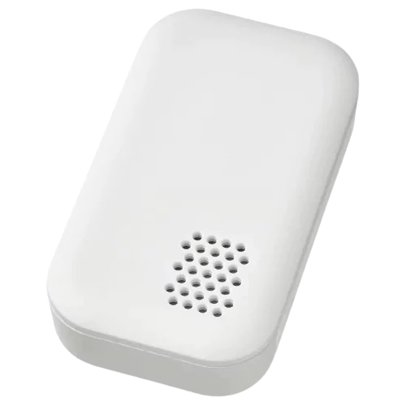

# IKEA Zigbee drivers
This document provides instructions on how to install and use custom drivers for IKEA Zigbee devices on Hubitat hub.

These drivers enable advanced features and functionalities for the following devices:

Remotes:
* [Rodret Dimmer (E2201)](#rodret-dimmer-e2201)
* [Somrig Shortcut Button (E2213)](#somrig-shortcut-button-e2213)
* [Styrbar Remote Control N2 (E2002)](#styrbar-remote-control-n2-e2002)
* [Symfonisk Sound Remote Gen2 (E2123)](#symfonisk-sound-remote-gen2-e2123)
* [Tradfri On/Off Switch (E1743)](#tradfri-onoff-switch-e1743)
* [Tradfri Open/Close Remote (E1766)](#tradfri-openclose-remote-e1766)
* [Tradfri Remote Control (E1810)](#tradfri-remote-control-e1810)
* [Tradfri Shortcut Button (E1812)](#tradfri-shortcut-button-e1812)

Sensors:
* [Badring Water Leakage Sensor (E2202)](#badring-water-leakage-sensor-e2202)
* [Parasoll Door/Window Sensor (E2013)](#parasoll-doorwindow-sensor-e2013)
* [Tradfri Motion Sensor (E1745)](#tradfri-motion-sensor-e1745)
* [Vallhorn Motion Sensor (E2134)](#vallhorn-motion-sensor-e2134)
* [Vindstyrka Air Quality Sensor (E2112)](#vindstyrka-air-quality-sensor-e2112)

Outlets:
* [Askvader On/Off Switch (E1836)](#askvader-onoff-switch-e1836)
* [Tradfri Control Outlet (E1603, E1706)](#tradfri-control-outlet-e1603-e1706)
* [Tretakt Smart Plug (E2204)](#tretakt-smart-plug-e2204)

Lights:
* [Dimmable Light](#dimmable-light)
* [White Spectrum Light](#white-spectrum-light)
* [Color White Spectrum Light](#color-white-spectrum-light)

Other:
* [Starkvind Air Purifier (E2006)](#starkvind-air-purifier-e2006)

Devices from other vendors (not in HPM):
* [Aqara Dual Relay Module T2 (DCM-K01)](#aqara-dual-relay-module-t2-dcm-k01)
* [Legrand Connected Outlet (741811)](#legrand-connected-outlet-741811)
* [Philips Hue Wall Switch Module (RDM001)](#philips-hue-wall-switch-module-rdm001)
* [Philips Hue Dimmer Switch (RWL022)](#philips-hue-dimmer-switch-rwl022)
* [Swann One Key Fob (SWO-KEF1PA)](#swann-one-key-fob-swo-kef1pa)

Advanced features:
* [Zigbee Bindings](Zigbee_Bindings.md)

## Installation
There are two ways to install the drivers: using Hubitat Package Manager (HPM) or manually importing the driver code.

### HPM Installation (Recommended)
HPM is an app that allows you to easily install and update custom drivers and apps on your Hubitat hub. To use HPM, you need to have it installed on your hub first.

Once you have HPM installed, follow these steps to install the IKEA Zigbee drivers:

* In the Hubitat interface, go to **Apps** and select **Hubitat Package Manager**.
* Select **Install**, then **Search by Keywords**.
* Enter **IKEA Zigbee drivers** in the search box and click **Next**.
* Select **IKEA Zigbee drivers by Dan Danache** and click **Next**.
* Select the driver(s) you need from the dropdown list and follow the install instructions.

### Manual Installation
If you don’t want to use HPM, you can also install the drivers manually by importing the driver code from GitHub. Follow these steps to do so:

* In the Hubitat interface, go to **Drivers Code**.
* Click **New Driver** in the top right, then click **Import** in the top right.
* Search below for your device, look for the **Manual install file** property and enter it in the URL field.
* Click **Import**, then click **OK** and the code should load in the editor.
* Click **Save** in the top right.

More info about installing custom drivers is available in the [Official Documentation](https://docs2.hubitat.com/en/how-to/install-custom-drivers).

## Device Features and Pairing
Below you can find the details of each device, including the features and pairing instructions.

### Askvader On/Off Switch (E1836)

| Parameter | Details |
|-----------|-------------|
| Product Image |  |
| Product Code | `504.638.80` |
| Manual install file | `https://raw.githubusercontent.com/dan-danache/hubitat/master/ikea-zigbee-drivers/Ikea_E1836.groovy` |
| Tested firmwares | `1.0.002` |
| Since version | `3.1.0` |

#### Features
* Commands: On, Off, Toggle, On with Timed Off
* Configure what happens after a power outage (Power On, Power Off, Restore previous state)
* Health status: online / offline
* Refresh switch state on demand
* Can be member of Zigbee groups

#### Pairing Instructions
1. Locate the small reset hole (located between the On/Off button and the LED light) and have a pin or pencil ready to fit the hole.
1. If the device is already plugged in, unplug it for 20 seconds (power-cycle) before each pairing attempt.
1. Plug the device back into an outlet.
1. In the Hubitat interface, navigate to **Devices**, click **Add Device** in the top right corner, select **Zigbee**, and then click **Start Zigbee Pairing**.
1. Insert the pin into the reset hole and press it for at least 5 seconds; the LED light will start blinking upon release.
1. Return to the pairing page, provide a name for your device, and assign it to a room.
1. You're all set! Enjoy using your Askvader On/Off Switch.

### Badring Water Leakage Sensor (E2202)

| Parameter | Details |
|-----------|-------------|
| Product Image |  |
| Product Code | `605.043.52` |
| Manual install file | `https://raw.githubusercontent.com/dan-danache/hubitat/master/ikea-zigbee-drivers/Ikea_E2202.groovy` |
| Tested firmwares | `1.0.7` |
| Since version | `3.9.0` |

#### Features
* Water detection: wet / dry
* Battery report: %
* Health status: online / offline

#### Pairing Instructions
1. Open the battery compartiment and you should see the small pair button (🔗).
1. In the Hubitat interface, navigate to **Devices**, click **Add Device** in the top right corner, select **Zigbee**, and then click **Start Zigbee Pairing**.
1. **Important**: Move closer to your Hubitat hub and press the pair button in the battery compartment **four times within five seconds**.
1. **Important**: Immediately after the device LED starts blinking red, position the device as close as possible to your Hubitat hub for **at least 30 seconds** (wait until the LED stops blinking and turns off).
1. Return to the pairing page, provide a name for your device, and assign it to a room.
1. Close the device battery compartiment.
1. You're all set! Enjoy using your Badring Water Leakage Sensor.

### Parasoll Door/Window Sensor (E2013)

| Parameter | Details |
|-----------|-------------|
| Product Image |  |
| Product Code | `805.043.08` |
| Manual install file | `https://raw.githubusercontent.com/dan-danache/hubitat/master/ikea-zigbee-drivers/Ikea_E2013.groovy` |
| Tested firmwares | `1.0.19` |
| Since version | `3.6.0` |

#### Features
* Contact status: open / close
* Battery report: %
* Health status: online / offline
* Directly control Zigbee devices: On/Off
* Directly control Zigbee groups: On/Off

#### Pairing Instructions
1. Remove device from its position using a small screwdriver and, on the back, you should see the small pair button (🔗).
1. In the Hubitat interface, navigate to **Devices**, click **Add Device** in the top right corner, select **Zigbee**, and then click **Start Zigbee Pairing**.
1. **Important**: Move closer to your Hubitat hub and press the pair button in the battery compartment **four times within five seconds**.
1. **Important**: Immediately after the device LED starts blinking red, position the device as close as possible to your Hubitat hub for **at least 30 seconds** (wait until the LED stops blinking and turns off).
1. Return to the pairing page, provide a name for your device, and assign it to a room.
1. Place the device back to its position by gently pressing it until you hear it clicking in place.
1. You're all set! Enjoy using your Parasoll Door/Window Sensor.

### Rodret Dimmer (E2201)

| Parameter | Details |
|-----------|-------------|
| Product Image |  |
| Product Code | `205.281.28`｜`805.597.96` |
| Manual install file | `https://raw.githubusercontent.com/dan-danache/hubitat/master/ikea-zigbee-drivers/Ikea_E2201.groovy` |
| Tested firmwares | `1.0.47` |
| Since version | `2.0.0` |

#### Features
* Button Push events: both buttons
* Button Hold events: both buttons
* Button Release events: both buttons
* Battery report: %
* Health status: online / offline
* Directly control Zigbee devices: On/Off and Brightness
* Directly control Zigbee groups: On/Off and Brightness

#### Pairing Instructions
1. Open the battery compartiment and you should see the small pair button (🔗).
1. In the Hubitat interface, navigate to **Devices**, click **Add Device** in the top right corner, select **Zigbee**, and then click **Start Zigbee Pairing**.
1. **Important**: Move closer to your Hubitat hub and press the pair button in the battery compartment **four times within five seconds**.
1. **Important**: Immediately after the device LED starts blinking red, position the device as close as possible to your Hubitat hub for **at least 30 seconds** (wait until the LED stops blinking and turns off).
1. Return to the pairing page, provide a name for your device, and assign it to a room.
1. Close the device battery compartiment.
1. You're all set! Enjoy using your Rodret Dimmer.

### Somrig Shortcut Button (E2213)

| Parameter | Details |
|-----------|-------------|
| Product Image |  |
| Product Code | `305.603.54` |
| Manual install file | `https://raw.githubusercontent.com/dan-danache/hubitat/master/ikea-zigbee-drivers/Ikea_E2213.groovy` |
| Tested firmwares | `1.0.20` |
| Since version | `3.6.0` |

#### Features
* Button Push events: both buttons
* Button Double-Tap event: both buttons
* Button Hold events: both buttons
* Button Release events: both buttons
* Battery report: %
* Health status: online / offline

#### Pairing Instructions
1. Using a small screwdriver, open the battery compartiment and you should see the small pair button (🔗).
1. In the Hubitat interface, navigate to **Devices**, click **Add Device** in the top right corner, select **Zigbee**, and then click **Start Zigbee Pairing**.
1. **Important**: Move closer to your Hubitat hub and press the pair button in the battery compartment **four times within five seconds**.
1. **Important**: Immediately after the device LED starts blinking red, position the device as close as possible to your Hubitat hub for **at least 30 seconds** (wait until the LED stops blinking and turns off).
1. Return to the pairing page, provide a name for your device, and assign it to a room.
1. Close the device battery compartiment.
1. You're all set! Enjoy using your Somrig Shortcut Button.

### Starkvind Air Purifier (E2006)

| Parameter | Details |
|-----------|-------------|
| Product Image |  |
| Product Code | `194.442.19` |
| Manual install file | `https://raw.githubusercontent.com/dan-danache/hubitat/master/ikea-zigbee-drivers/Ikea_E2006.groovy` |
| Tested firmwares | `1.0.033`｜`1.1.001` |
| Since version | `3.5.0` |

#### Features
* Commands: On, Off, Toggle, Set/Cycle fan speed
* Particulate Matter < 2.5 microns (PM 2.5) sensor data
* Calculate US AQI score based on PM 2.5 value
* Filter usage (%) and Filter status (normal / replace) information
* Configuration: Sensor report frequency, Filter life time, LED status
* Child lock: enable / disable physical controls on the device
* Dark mode: turn off LED indicator on the device, ensuring total darkness
* Health status: online / offline
* Refresh device state on demand

#### Pairing Instructions
1. If the device is already plugged in, unplug it for 20 seconds (power-cycle) before each pairing attempt.
1. Plug the device back into an outlet.
1. Open the round top lid and you should see the pair button (🔗) next to the filter reset button.
1. In the Hubitat interface, navigate to **Devices**, click **Add Device** in the top right corner, select **Zigbee**, and then click **Start Zigbee Pairing**.
1. Press and hold the pair button **for at least 5 seconds** until the LED starts blinking.
1. Return to the pairing page, provide a name for your device, and assign it to a room.
1. Put back the lid and fix it in place.
1. You're all set! Enjoy using your Starkvind Air Purifier.

### Styrbar Remote Control N2 (E2002)

| Parameter | Details |
|-----------|-------------|
| Product Image |  |
| Product Code | `304.883.63` |
| Manual install file | `https://raw.githubusercontent.com/dan-danache/hubitat/master/ikea-zigbee-drivers/Ikea_E2002.groovy` |
| Tested firmwares | `1.0.024`｜`2.4.5` |
| Since version | `2.0.0` |

#### Features
* Button Push events for: all buttons
* Button Hold events for: Button 1 (🔆) and Button 2 (🔅)
* Button Release events for: Button 1 (🔆), Button 2 (🔅)
* Battery report: %
* Health status: online / offline
* Directly control Zigbee devices: On/Off and Brightness

#### Known Issues
* The Hold / Release events don't work correctly on the Next and Prev buttons.
* Old firmware versions (below 2.4.5) send multiple events per button push. You can update the device to the latest version using Hubitat.

#### Pairing Instructions
1. Using a small screwdriver, open the battery compartiment and you should see the small pair button (🔗).
1. In the Hubitat interface, navigate to **Devices**, click **Add Device** in the top right corner, select **Zigbee**, and then click **Start Zigbee Pairing**.
1. **Important**: Move closer to your Hubitat hub and press the pair button in the battery compartment **four times within five seconds**.
1. **Important**: Immediately after the device LED starts blinking red, position the device as close as possible to your Hubitat hub for **at least 30 seconds** (wait until the LED stops blinking and turns off).
1. Return to the pairing page, provide a name for your device, and assign it to a room.
1. Close the device battery compartiment.
1. You're all set! Enjoy using your Styrbar Remote Control.

### Symfonisk Sound Remote Gen2 (E2123)

| Parameter | Details |
|-----------|-------------|
| Product Image |  |
| Product Code | `305.273.12` |
| Manual install file | `https://raw.githubusercontent.com/dan-danache/hubitat/master/ikea-zigbee-drivers/Ikea_E2123.groovy` |
| Tested firmwares | `1.0.012`｜`1.0.35` |
| Since version | `1.0.0` |

#### Features
* Button Push events: all buttons
* Button Hold events: Button 2 (Plus), Button 3 (Minus), Button 6 (•) and Button 7 (••)
* Button Release events: Button 6 (•) and Button 7 (••)
* Button Double-Tap events: Button 6 (•) and Button 7 (••)
* Battery report: %
* Health status: online / offline
* Directly control Zigbee devices: On/Off
* Directly control Zigbee groups: On/Off

#### Pairing Instructions
1. Open the battery compartiment and you should see the small pair button (🔗).
1. In the Hubitat interface, navigate to **Devices**, click **Add Device** in the top right corner, select **Zigbee**, and then click **Start Zigbee Pairing**.
1. **Important**: Move closer to your Hubitat hub and press the pair button in the battery compartment **four times within five seconds**.
1. **Important**: Immediately after the device LED starts blinking red, keep the device **as close as you can** against your Hubitat hub until the LED stops blinking and turns off.
1. Return to the pairing page, provide a name for your device, and assign it to a room.
1. Close the device battery compartiment.
1. You're all set! Enjoy using your Symfonisk Sound Remote.

### Tradfri Control Outlet (E1603, E1706)

| Parameter | Details |
|-----------|-------------|
| Product Image |  |
| Product Code | `304.883.63`｜`303.561.69` |
| Manual install file | `https://raw.githubusercontent.com/dan-danache/hubitat/master/ikea-zigbee-drivers/Ikea_E1603.groovy` |
| Tested firmwares | `2.0.0244`｜`2.3.089` |
| Since version | `2.0.0` |

#### Features
* Commands: On, Off, Toggle, On with Timed Off
* Configure what happens after a power outage (Power On, Power Off, Restore previous state)
* Health status: online / offline
* Refresh switch state on demand
* Can be member of Zigbee groups

#### Pairing Instructions
1. Find the small reset hole on the side of the device and make sure you have at hand a pin that can fit the reset hole
   (e.g.: a paper clip or SIM card eject pin).
1. If the device is already plugged in, unplug it for 20 seconds (power-cycle) before each pairing attempt.
1. Plug the device back into an outlet.
1. In the Hubitat interface, navigate to **Devices**, click **Add Device** in the top right corner, select **Zigbee**, and then click **Start Zigbee Pairing**.
1. Insert the pin into the reset hole and press it for at least 5 seconds; upon release, the LED light will start
   blinking.
1. Return to the pairing page, provide a name for your device, and assign it to a room.
1. You're all set! Enjoy using your Tradfri Control Outlet.

### Tradfri Motion Sensor (E1745)

| Parameter | Details |
|-----------|-------------|
| Product Image |  |
| Product Code | `704.299.13` |
| Manual install file | `https://raw.githubusercontent.com/dan-danache/hubitat/master/ikea-zigbee-drivers/Ikea_E1745.groovy` |
| Tested firmwares | `24.4.5` |
| Since version | `2.3.0` |

#### Features
* Motion detection: active / inactive (50 seconds cooldown)
* Illumination detection: dim / bright
* Option to detect motion only when dark
* Battery report: %
* Health status: online / offline

#### Known Issues
* Old firmware versions (below 24.4.5) suppport binding to groups only and this functionality is not supported by the
  Hubitat hub. You can update the device to the latest version using Hubitat.
* Illumination is reported only when motion is detected.

#### Pairing Instructions
1. Open the back compartiment and you should see the small pair button (🔗).
1. In the Hubitat interface, navigate to **Devices**, click **Add Device** in the top right corner, select **Zigbee**, and then click **Start Zigbee Pairing**.
1. **Important**: Move closer to your Hubitat hub and press the pair button in the battery compartment **four times within five seconds**.
1. **Important**: Immediately after the device LED starts blinking red, position the device as close as possible to your Hubitat hub for **at least 30 seconds** (wait until the LED stops blinking and turns off).
1. Return to the pairing page, provide a name for your device, and assign it to a room.
1. Close the device battery compartiment.
1. You're all set! Enjoy using your Tradfri Motion Sensor.

### Tradfri On/Off Switch (E1743)

| Parameter | Details |
|-----------|-------------|
| Product Image |  |
| Product Code | `203.563.82`｜`404.677.65`｜`403.563.81` |
| Manual install file | `https://raw.githubusercontent.com/dan-danache/hubitat/master/ikea-zigbee-drivers/Ikea_E1743.groovy` |
| Tested firmwares | `2.2.010`｜`24.4.6` |
| Since version | `2.0.0` |

#### Features
* Button Push events: both buttons
* Button Hold events: both buttons
* Button Release events: both buttons
* Battery report: %
* Health status: online / offline
* Directly control Zigbee devices: On/Off and Brightness

#### Pairing Instructions
1. Using a small screwdriver, open the battery compartiment and you should see the small pair button (🔗).
1. In the Hubitat interface, navigate to **Devices**, click **Add Device** in the top right corner, select **Zigbee**, and then click **Start Zigbee Pairing**.
1. **Important**: Move closer to your Hubitat hub and press the pair button in the battery compartment **four times within five seconds**.
1. **Important**: Immediately after the device LED starts blinking red, position the device as close as possible to your Hubitat hub for **at least 30 seconds** (wait until the LED stops blinking and turns off).
1. Return to the pairing page, provide a name for your device, and assign it to a room.
1. Close the device battery compartiment.
1. You're all set! Enjoy using your Tradfri On/Off Switch.

### Tradfri Open/Close Remote (E1766)

| Parameter | Details |
|-----------|-------------|
| Product Image |  |
| Product Code | |
| Manual install file | `https://raw.githubusercontent.com/dan-danache/hubitat/master/ikea-zigbee-drivers/Ikea_E1766.groovy` |
| Tested firmwares | `24.4.6` |
| Since version | `3.3.0` |

#### Features
* Button Push events: both buttons
* Button Release events: both buttons
* Battery report: %
* Health status: online / offline
* Directly control Zigbee devices: Window Covering

#### Pairing Instructions
1. Using a small screwdriver, open the battery compartiment and you should see the small pair button (🔗).
1. In the Hubitat interface, navigate to **Devices**, click **Add Device** in the top right corner, select **Zigbee**, and then click **Start Zigbee Pairing**.
1. **Important**: Move closer to your Hubitat hub and press the pair button in the battery compartment **four times within five seconds**.
1. **Important**: Immediately after the device LED starts blinking red, position the device as close as possible to your Hubitat hub for **at least 30 seconds** (wait until the LED stops blinking and turns off).
1. Return to the pairing page, provide a name for your device, and assign it to a room.
1. Close the device battery compartiment.
1. You're all set! Enjoy using your Tradfri Open/Close Remote.

### Tradfri Remote Control (E1810)

| Parameter | Details |
|-----------|-------------|
| Product Image |  |
| Product Code | `304.431.24`｜`004.431.30` |
| Manual install file | `https://raw.githubusercontent.com/dan-danache/hubitat/master/ikea-zigbee-drivers/Ikea_E1810.groovy` |
| Tested firmwares | `24.4.5` |
| Since version | `1.1.0` |

#### Features
* Button Push events: all buttons
* Button Hold events: Button 2 (🔆), Button 3 (🔅), Button 4 (Next) and Button 5 (Prev)
* Button Release events: Button 2 (🔆), Button 3 (🔅), Button 4 (Next) and Button 5 (Prev)
* Button 1 (Play) acts as a switch (on / off)
* Button 2 (🔆) and Button 3 (🔅) act as a switch level (0 - 100%)
* Battery report: %
* Health status: online / offline
* Directly control Zigbee devices: On/Off and Brightness

#### Known Issues
* Old firmware versions suppport binding to groups only and this functionality is not supported by the Hubitat hub. You can update the device to the latest version using Hubitat.

#### Pairing Instructions
1. Open the battery compartiment and you should see the small pair button (🔗).
1. In the Hubitat interface, navigate to **Devices**, click **Add Device** in the top right corner, select **Zigbee**, and then click **Start Zigbee Pairing**.
1. **Important**: Move closer to your Hubitat hub and press the pair button in the battery compartment **four times within five seconds**.
1. **Important**: Immediately after the device LED starts blinking red, position the device as close as possible to your Hubitat hub for **at least 30 seconds** (wait until the LED stops blinking and turns off).
1. Return to the pairing page, provide a name for your device, and assign it to a room.
1. Close the device battery compartiment.
1. You're all set! Enjoy using your Tradfri Remote Control.

### Tradfri Shortcut Button (E1812)

| Parameter | Details |
|-----------|-------------|
| Product Image |  |
| Product Code | `203.563.82`｜`404.677.65`｜`403.563.81` |
| Manual install file | `https://raw.githubusercontent.com/dan-danache/hubitat/master/ikea-zigbee-drivers/Ikea_E1812.groovy` |
| Tested firmwares | `2.3.015`｜`24.4.6` |
| Since version | `2.0.0` |

#### Features
* Button Push event
* Button Double-Tap event (only on firmware `24.4.6` and above)
* Button Hold event
* Button Release event
* Battery report: %
* Health status: online / offline
* Directly control Zigbee devices: On/Off

#### Pairing Instructions
1. Using a small screwdriver, open the battery compartiment and you should see the small pair button (🔗).
1. In the Hubitat interface, navigate to **Devices**, click **Add Device** in the top right corner, select **Zigbee**, and then click **Start Zigbee Pairing**.
1. **Important**: Move closer to your Hubitat hub and press the pair button in the battery compartment **four times within five seconds**; the red LED light can be seen from the back / battery side.
1. **Important**: Immediately after the device LED starts blinking red, position the device as close as possible to your Hubitat hub for **at least 30 seconds** (wait until the LED stops blinking and turns off).
1. Return to the pairing page, provide a name for your device, and assign it to a room.
1. Close the device battery compartiment.
1. You're all set! Enjoy using your Tradfri Shortcut Button.

### Tretakt Smart Plug (E2204)

| Parameter | Details |
|-----------|-------------|
| Product Image |  |
| Product Code | `805.403.49` |
| Manual install file | `https://raw.githubusercontent.com/dan-danache/hubitat/master/ikea-zigbee-drivers/Ikea_E2204.groovy` |
| Tested firmwares | `2.4.4` |
| Since version | `4.0.0` |

#### Features
* Commands: On, Off, Toggle, On with Timed Off
* Configure what happens after a power outage (Power On, Power Off, Restore previous state)
* Child lock: enable / disable physical button on the device
* Dark mode: turn off LED indicator on the device, ensuring total darkness
* Health status: online / offline
* Refresh switch state on demand
* Can be member of Zigbee groups

#### Pairing Instructions
1. Find the small reset button near on/off button and make sure you have a pointy object at hand.
1. If the device is already plugged in, unplug it for 20 seconds (power-cycle) before each pairing attempt.
1. Plug the device back into an outlet.
1. In the Hubitat interface, navigate to **Devices**, click **Add Device** in the top right corner, select **Zigbee**, and then click **Start Zigbee Pairing**.
1. Push the small reset button on top of the smart plug with a pointy object for at least 5 seconds until the LED starts pulsating.
1. Return to the pairing page, provide a name for your device, and assign it to a room.
1. You're all set! Enjoy using your Tretakt Smart Plug.

### Vallhorn Motion Sensor (E2134)

| Parameter | Details |
|-----------|-------------|
| Product Image |  |
| Product Code | `405.043.48` |
| Manual install file | `https://raw.githubusercontent.com/dan-danache/hubitat/master/ikea-zigbee-drivers/Ikea_E2134.groovy` |
| Tested firmwares | `1.0.57` |
| Since version | `3.6.0` |

#### Features
* Motion detection: active / inactive (20 seconds cooldown)
* Illumination lux reporting (5 minutes cooldown)
* Battery report: %
* Health status: online / offline

#### Known Issues
* Max reported illuminance is 1364 lux; more than enough for indoor usage

#### Pairing Instructions
1. Remove device from its position using a small screwdriver and, on the back, you should see the small pair button (🔗).
1. In the Hubitat interface, navigate to **Devices**, click **Add Device** in the top right corner, select **Zigbee**, and then click **Start Zigbee Pairing**.
1. **Important**: Move closer to your Hubitat hub and press the pair button in the battery compartment **four times within five seconds**.
1. **Important**: Immediately after the device LED starts blinking red, keep the device **as close as you can** against your Hubitat hub for ****at least 30 seconds**** (after the front light stops blinking and turns off).
1. Return to the pairing page, provide a name for your device, and assign it to a room.
1. Place the device back to its position by gently pressing it until you hear it clicking in place.
1. You're all set! Enjoy using your Vallhorn Motion Sensor.

### Vindstyrka Air Quality Sensor (E2112)

| Parameter | Details |
|-----------|-------------|
| Product Image |  |
| Product Code | `404.982.34` |
| Manual install file | `https://raw.githubusercontent.com/dan-danache/hubitat/master/ikea-zigbee-drivers/Ikea_E2112.groovy` |
| Tested firmwares | `1.0.10`｜`1.0.11` |
| Since version | `3.8.0` |

#### Features
* Particulate Matter < 2.5 microns (PM 2.5) sensor data
* Calculate US AQI score based on PM 2.5 value
* [Sensirion VOC Index](https://sensirion.com/media/documents/02232963/6294E043/Info_Note_VOC_Index.pdf) (1-500)
* Temperature and Relative Humidity
* Health status: online / offline

#### Pairing Instructions
1. In the Hubitat interface, navigate to **Devices**, click **Add Device** in the top right corner, select **Zigbee**, and then click **Start Zigbee Pairing**.
1. Click the pair button (🔗), located on the top of the device, 4 times in 5 seconds.
1. Return to the pairing page, provide a name for your device, and assign it to a room.
1. You're all set! Enjoy using your Vindstyrka Air Quality Sensor.

### Dimmable Light

| Parameter | Details |
|-----------|-------------|
| Icon |  |
| Manual install file | `https://raw.githubusercontent.com/dan-danache/hubitat/master/ikea-zigbee-drivers/Ikea_DIM-Light.groovy` |
| Since version | `5.0.0` |

#### Features
* Commands: On, Off, Toggle, On with Timed Off
* Brightness control: Set brightness level, Start/Stop brightness level change, Step brightness level up/down
* Configure what happens after a power outage (Power On, Power Off, Restore previous state)
* Configure brightness level when turned on (Always the same fixed value, Restore last level)
* Pre-staging: Set brightness level when the lights are off (and they stay off). When the lights are turned on, they will start at the specified level.
* Health status: online / offline
* Refresh light state on demand
* Can be member of Zigbee groups

#### Tested devices
* 10EU-IL-1: Tradfri LED Driver 10W
* 30EU-IL-2: Tradfri LED Driver 30W
* 30-IL44-1: Silverglans LED Driver 30W

### White Spectrum Light

| Parameter | Details |
|-----------|-------------|
| Icon |  |
| Manual install file | `https://raw.githubusercontent.com/dan-danache/hubitat/master/ikea-zigbee-drivers/Ikea_WS-Light.groovy` |
| Since version | `5.0.0` |

#### Features
* Commands: On, Off, Toggle, On with Timed Off
* Brightness control: Set brightness level, Start/Stop brightness level change, Step brightness level up/down
* Color temperature (CT) control: Set color temperature, Start/Stop color temperature change, Step color temperature up/down
* Configure what happens after a power outage (Power On, Power Off, Restore previous state)
* Configure brightness level when turned on (Always the same fixed value, Restore last level)
* Pre-staging: Set brightness level when the lights are off (and they stay off). When the lights are turned on, they will start at the specified level.
* Pre-staging: Set color temperature when the lights are off (and they stay off). When the lights are turned on, they will start with the specified color temperature.
* Health status: online / offline
* Refresh light state on demand
* Can be member of Zigbee groups

#### Known Issues
* Color temperature and brightness level can be set together if the "Transition time" is 0 (or left blank in the UI); if a transition time is specified, only the color temperature is applied.

#### Tested devices
* LED2101G4: Tradfri Bulb E14 WS Globe 470lm
* LED1949C5: Tradfri Bulb E14 WS Candle Opal 470lm

#### Pairing Instructions
1. If the device is already powered on, power it off for 20 seconds (power-cycle) before each pairing attempt.
1. In the Hubitat interface, navigate to **Devices**, click **Add Device** in the top right corner, select **Zigbee**, and then click **Start Zigbee Pairing**.
1. Put the light in pairing mode.
1. Return to the pairing page, provide a name for your device, and assign it to a room.
1. You're all set! Enjoy using your White Spectrum Light.

### Color White Spectrum Light

| Parameter | Details |
|-----------|-------------|
| Icon |  |
| Manual install file | `https://raw.githubusercontent.com/dan-danache/hubitat/master/ikea-zigbee-drivers/Ikea_CWS-Light.groovy` |
| Since version | `5.0.0` |

#### Features
* Commands: On, Off, Toggle, On with Timed Off
* Brightness control: Set brightness level, Start/Stop brightness level change, Step brightness level up/down
* Color temperature (CT) control: Set color temperature, Start/Stop color temperature change, Step color temperature up/down
* Color (RGB) control: Set color hue and/or saturation, display color name and colo mode
* Configure what happens after a power outage (Power On, Power Off, Restore previous state)
* Configure brightness level when turned on (Always the same fixed value, Restore last level)
* Pre-staging: Set brightness level when the lights are off (and they stay off). When the lights are turned on, they will start at the specified level.
* Pre-staging: Set color temperature when the lights are off (and they stay off). When the lights are turned on, they will start with the specified color temperature.
* Pre-staging: Set color when the lights are off (and they stay off). When the lights are turned on, they will start with the specified color.
* Health status: online / offline
* Refresh light state on demand
* Can be member of Zigbee groups

#### Known Issues
* Color temperature and brightness level can be set together if the "Transition time" is 0 (or left blank in the UI); if a transition time is specified, only the color temperature is applied.

#### Tested devices
* L2112: Ormanas LED Strip
* LED2111G6: Tradfri Bulb E14 CWS Globe 806lm

#### Pairing Instructions
1. If the device is already powered on, power it off for 20 seconds (power-cycle) before each pairing attempt.
1. In the Hubitat interface, navigate to **Devices**, click **Add Device** in the top right corner, select **Zigbee**, and then click **Start Zigbee Pairing**.
1. Put the light in pairing mode.
1. Return to the pairing page, provide a name for your device, and assign it to a room.
1. You're all set! Enjoy using your White Spectrum Light.

### Aqara Dual Relay Module T2 (DCM-K01)

| Parameter | Details |
|-----------|-------------|
| Product Image |  |
| Product Link | https://www.aqara.com/eu/dual-relay-module-t2/ |
| Manual install file | `https://raw.githubusercontent.com/dan-danache/hubitat/master/ikea-zigbee-drivers/Aqara_DCM-K01.groovy` |
| Since version | `4.0.0` |

#### Features
* Standard operation mode: switch S1/S2 controls relay L1/L2
* Decoupled operation mode: switch S1/S2 only sends "push" events
* Configure switch type: latching / momentary / disabled
* Configure relay type: wet contact / dry contact / pulse mode (with configurable pulse duration: 200ms .. 2000ms)
* Configure interlock mode: prevent both Relay L1 and Relay L2 being On at the same time
* Configure what happens after a power outage (Power On, Power Off, Restore previous state)
* Report device temperature
* Report power (W): L1 + L2
* Report energy consumption (kWh): L1 + L2
* Health status: online / offline
* Refresh device state on demand

#### Pairing Instructions
1. If the device is already powered on, disconnect it for 20 seconds (power-cycle) before each pairing attempt.
1. Power on the device.
1. In the Hubitat interface, navigate to **Devices**, click **Add Device** in the top right corner, select **Zigbee**, and then click **Start Zigbee Pairing**.
1. Push and hold the pairing button for 5 seconds; the LED light will start blinking upon release.
1. Return to the pairing page, provide a name for your device, and assign it to a room.
1. You're all set! Enjoy using your Aqara Dual Relay Module T2.

### Legrand Connected Outlet (741811)

| Parameter | Details |
|-----------|-------------|
| Product Image |  |
| Manual install file | `https://raw.githubusercontent.com/dan-danache/hubitat/master/ikea-zigbee-drivers/Legrand_741811.groovy` |
| Tested firmwares | `003e` |
| Since version | `4.0.0` |

#### Features
* Commands: On, Off, Toggle, On with Timed Off
* Configure what happens after a power outage (Power On, Power Off, Restore previous state)
* LED mode: always On, always Off, follow device power state
* Report power (W)
* Health status: online / offline
* Refresh device state on demand

#### Pairing Instructions
1. Find the small reset hole under the device face plate and make sure you have at hand a pin that can fit the reset hole
   (e.g.: a paper clip or SIM card eject pin).
1. If the device is already powered on, disconnect it for 20 seconds (power-cycle) before each pairing attempt.
1. Power on the device.
1. In the Hubitat interface, navigate to **Devices**, click **Add Device** in the top right corner, select **Zigbee**, and then click **Start Zigbee Pairing**.
1. Insert the pin into the reset hole and press it for at least 5 seconds; upon release, the LED light will start blinking.
1. Return to the pairing page, provide a name for your device, and assign it to a room.
1. You're all set! Enjoy using your Legrand Connected Outlet.

### Philips Hue Wall Switch Module (RDM001)

| Parameter | Details |
|-----------|-------------|
| Product Image |  |
| Product Link | [Single](https://www.philips-hue.com/en-us/p/hue-philips-hue-wall-switch-module/046677571160)｜[2-Pack](https://www.philips-hue.com/en-us/p/hue-philips-hue-wall-switch-module-2-pack/046677571245) |
| Manual install file | `https://raw.githubusercontent.com/dan-danache/hubitat/master/ikea-zigbee-drivers/Philips_RDM001.groovy` |
| Since version | `4.0.0` |

#### Features
* Configure switch style: single rocker / single push button / dual rocker / dual push button
* Button Push event: both switches
* Battery report: %
* Health status: online / offline
* Directly control Zigbee devices: On/Off
* Directly control Zigbee groups: On/Off

#### Pairing Instructions
1. Connect the S1 switch cable
1. In the Hubitat interface, navigate to **Devices**, click **Add Device** in the top right corner, select **Zigbee**, and then click **Start Zigbee Pairing**.
1. Press the reset button for 10 seconds.
1. When the LED starts blinking, close and release the S1 switch.
1. Return to the pairing page, provide a name for your device, and assign it to a room.
1. You're all set! Enjoy using your Philips Hue Wall Switch Module.

### Philips Hue Dimmer Switch (RWL022)

| Parameter | Details |
|-----------|-------------|
| Product Image |  |
| Product Link | https://www.philips-hue.com/en-gb/p/hue-dimmer-switch--latest-model-/8719514274617 |
| Manual install file | `https://raw.githubusercontent.com/dan-danache/hubitat/master/ikea-zigbee-drivers/Philips_RWL022.groovy` |
| Since version | `4.0.0` |

#### Features
* Button Push event: all 4 buttons
* Button Hold events: all 4 buttons
* Button Release events: all 4 buttons
* Battery report: %
* Health status: online / offline
* Directly control Zigbee devices: On/Off
* Directly control Zigbee groups: On/Off

#### Pairing Instructions
1. Open the battery compartiment, find the small reset hole and make sure you have at hand a pin that can fit the reset hole
   (e.g.: a paper clip or SIM card eject pin).
1. In the Hubitat interface, navigate to **Devices**, click **Add Device** in the top right corner, select **Zigbee**, and then click **Start Zigbee Pairing**.
1. Insert the pin into the reset hole and press it for at least 5 seconds; upon release, the LED light on the first button will start blinking.
1. Return to the pairing page, provide a name for your device, and assign it to a room.
1. You're all set! Enjoy using your Philips Hue Dimmer Switch.

### Swann One Key Fob (SWO-KEF1PA)

| Parameter | Details |
|-----------|-------------|
| Product Image |  |
| Product Link | https://cdn.swann.com/media/wysiwyg/docs/en/Key_Fob_QSG.pdf |
| Manual install file | `https://raw.githubusercontent.com/dan-danache/hubitat/master/ikea-zigbee-drivers/Swann_SWO-KEF1PA.groovy` |
| Since version | `4.0.0` |

> I don't own this device and did not test it myself.

#### Features
* Button Push event: all 4 buttons
* Battery report: %
* Health status: online / offline

#### Known Issues
* Device drops off the Zigbee mesh (unknown reason)

#### Pairing Instructions
Unknown

---

