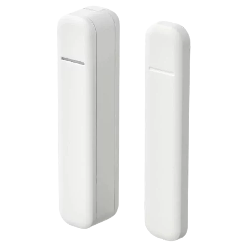
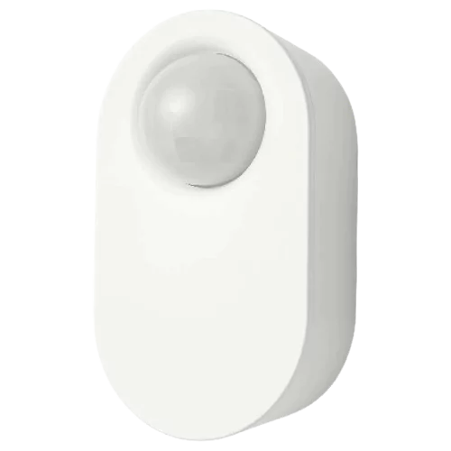
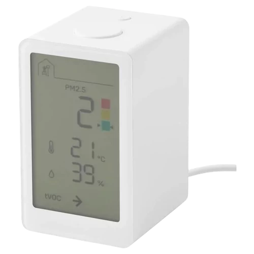

# IKEA Zigbee drivers
This document provides instructions on how to install and use custom drivers for IKEA Zigbee devices on Hubitat hub.

These drivers enable advanced features and functionalities for the following devices:

Remotes:
* [Rodret Dimmer (E2201)](#rodret-dimmer-e2201)
* [Somrig Shortcut Button (E2213)](#somrig-shortcut-button-e2213)
* [Styrbar Remote Control N2 (E2002)](#styrbar-remote-control-n2-e2002)
* [Symfonisk Sound Remote Gen2 (E2123)](#symfonisk-sound-remote-gen2-e2123)
* [Tradfri On/Off Switch (E1743)](#tradfri-onoff-switch-e1743)
* [Tradfri Open/Close Remote (E1766)](#tradfri-openclose-remote-e1766)
* [Tradfri Remote Control (E1810)](#tradfri-remote-control-e1810)
* [Tradfri Shortcut Button (E1812)](#tradfri-shortcut-button-e1812)

Sensors:
* [Badring Water Leakage Sensor (E2202)](#badring-water-leakage-sensor-e2202)
* [Parasoll Door/Window Sensor (E2013)](#parasoll-doorwindow-sensor-e2013)
* [Tradfri Motion Sensor (E1745)](#tradfri-motion-sensor-e1745)
* [Vallhorn Motion Sensor (E2134)](#vallhorn-motion-sensor-e2134)
* [Vindstyrka Air Quality Sensor (E2112)](#vindstyrka-air-quality-sensor-e2112)

Outlets:
* [Askvader On/Off Switch (E1836)](#askvader-onoff-switch-e1836)
* [Tradfri Control Outlet (E1603, E1706)](#tradfri-control-outlet-e1603-e1706)
* [Tretakt Smart Plug (E2204)](#tretakt-smart-plug-e2204)

Lights:
* [Dimmable Light](#dimmable-light)
* [White Spectrum Light](#white-spectrum-light)
* [Color White Spectrum Light](#color-white-spectrum-light)

Appliances:
* [Starkvind Air Purifier (E2006)](#starkvind-air-purifier-e2006)

Devices from other vendors (not in HPM):
* [Aqara Dual Relay Module T2 (DCM-K01)](#aqara-dual-relay-module-t2-dcm-k01)
* [Legrand Connected Outlet (741811)](#legrand-connected-outlet-741811)
* [Philips Hue Wall Switch Module (RDM001)](#philips-hue-wall-switch-module-rdm001)
* [Philips Hue Dimmer Switch (RWL022)](#philips-hue-dimmer-switch-rwl022)
* [Swann One Key Fob (SWO-KEF1PA)](#swann-one-key-fob-swo-kef1pa)

Advanced features:
* [Zigbee Bindings](Zigbee_Bindings.md)

## Installation
There are two ways to install the drivers: using Hubitat Package Manager (HPM) or manually importing the driver code.

### HPM Installation (Recommended)
HPM is an app that allows you to easily install and update custom drivers and apps on your Hubitat hub. To use HPM, you need to have it installed on your hub first.

Once you have HPM installed, follow these steps to install the IKEA Zigbee drivers:

1. In the Hubitat interface, go to **Apps** and select **Hubitat Package Manager**.
1. Select **Install**, then **Search by Keywords**.
1. Enter **IKEA Zigbee drivers** in the search box and click **Next**.
1. Select **IKEA Zigbee drivers by Dan Danache** and click **Next**.
1. Select the driver(s) you need from the dropdown list and follow the install instructions.

### Manual Installation
If you don"t want to use HPM, you can also install the drivers manually by importing the driver code from GitHub. Follow these steps to do so:

1. In the Hubitat interface, go to **Drivers Code**.
1. Click **New Driver** in the top right, then click **Import** in the top right.
1. Search below for your device, look for the **Manual install file** property and enter it in the URL field.
1. Click **Import**, then click **OK** and the code should load in the editor.
1. Click **Save** in the top right.

More info about installing custom drivers is available in the [Official Documentation](https://docs2.hubitat.com/en/how-to/install-custom-drivers).

## Remotes
Below you can find the details of each remote device, including the features and pairing instructions.

### Rodret Dimmer (E2201)

| Parameter | Details |
|-----------|-------------|
| Product Image |  |
| Product Code | `205.281.28`｜`805.597.96` |
| Manual install file | `https://raw.githubusercontent.com/dan-danache/hubitat/master/ikea-zigbee-drivers/Ikea_E2201.groovy` |
| Tested firmwares | `1.0.47` |
| Since version | `2.0.0` |

#### Features
* **Button Events**: Supports "Push", "Hold", and "Release" events for both buttons.
* **Battery Report**: Provides a percentage-based report on the current battery level.
* **Health Status**: Indicates the operational status of the device, showing whether it's "online" or "offline".
* **Direct Zigbee Device Control**: Enables direct control of On/Off and Brightness settings for Zigbee devices.
* **Direct Zigbee Group Control**: Enables direct control of On/Off and Brightness settings for Zigbee groups. This allows for efficient management of multiple devices.

#### Pairing Instructions
1. Open the battery compartiment and you should see the small pair button (🔗).
1. In the Hubitat interface, navigate to **Devices**, click **Add Device** in the top right corner, select **Zigbee**, and then click **Start Zigbee Pairing**.
1. **Important**: Move closer to your Hubitat hub and press the pair button in the battery compartment **four times within five seconds**.
1. **Important**: Immediately after the device LED starts blinking red, position the device as close as possible to your Hubitat hub for **at least 30 seconds** (wait until the LED stops blinking and turns off).
1. Return to the pairing page, provide a name for your device, and assign it to a room.
1. Close the device battery compartiment.
1. You're all set! Enjoy using your Rodret Dimmer.

### Somrig Shortcut Button (E2213)

| Parameter | Details |
|-----------|-------------|
| Product Image |  |
| Product Code | `305.603.54` |
| Manual install file | `https://raw.githubusercontent.com/dan-danache/hubitat/master/ikea-zigbee-drivers/Ikea_E2213.groovy` |
| Tested firmwares | `1.0.20` |
| Since version | `3.6.0` |

#### Features
* **Button Events**: Supports "Push", "Double-Tap", "Hold", and "Release" events for both buttons.
* **Battery Report**: Provides a percentage-based report on the current battery level.
* **Health Status**: Indicates the operational status of the device, showing whether it's "online" or "offline".
* **Direct Zigbee Device Control**: Enables direct control of On/Off and Brightness settings for Zigbee devices.
* **Direct Zigbee Group Control**: Enables direct control of On/Off and Brightness settings for Zigbee groups. This allows for efficient management of multiple devices.

#### Pairing Instructions
1. Using a small screwdriver, open the battery compartiment and you should see the small pair button (🔗).
1. In the Hubitat interface, navigate to **Devices**, click **Add Device** in the top right corner, select **Zigbee**, and then click **Start Zigbee Pairing**.
1. **Important**: Move closer to your Hubitat hub and press the pair button in the battery compartment **four times within five seconds**.
1. **Important**: Immediately after the device LED starts blinking red, position the device as close as possible to your Hubitat hub for **at least 30 seconds** (wait until the LED stops blinking and turns off).
1. Return to the pairing page, provide a name for your device, and assign it to a room.
1. Close the device battery compartiment.
1. You're all set! Enjoy using your Somrig Shortcut Button.

### Styrbar Remote Control N2 (E2002)

| Parameter | Details |
|-----------|-------------|
| Product Image |  |
| Product Code | `304.883.63` |
| Manual install file | `https://raw.githubusercontent.com/dan-danache/hubitat/master/ikea-zigbee-drivers/Ikea_E2002.groovy` |
| Tested firmwares | `1.0.024`｜`2.4.5` |
| Since version | `2.0.0` |

#### Features
* **Button Events**: Supports "Push" events for all buttons, "Hold" and "Release" events for Button 1 (🔆) and Button 2 (🔅).
* **Battery Report**: Provides a percentage-based report on the current battery level.
* **Health Status**: Indicates the operational status of the device, showing whether it's "online" or "offline".
* **Zigbee Device Control**: Enables direct control of On/Off, Brightness, and Scenes for Zigbee devices.

#### Known Issues
* The Hold / Release events don't work correctly on the Next and Prev buttons.
* Old firmware versions (below 2.4.5) send multiple events per button push. You can update the device to the latest version using Hubitat.

#### Pairing Instructions
1. Using a small screwdriver, open the battery compartiment and you should see the small pair button (🔗).
1. In the Hubitat interface, navigate to **Devices**, click **Add Device** in the top right corner, select **Zigbee**, and then click **Start Zigbee Pairing**.
1. **Important**: Move closer to your Hubitat hub and press the pair button in the battery compartment **four times within five seconds**.
1. **Important**: Immediately after the device LED starts blinking red, position the device as close as possible to your Hubitat hub for **at least 30 seconds** (wait until the LED stops blinking and turns off).
1. Return to the pairing page, provide a name for your device, and assign it to a room.
1. Close the device battery compartiment.
1. You're all set! Enjoy using your Styrbar Remote Control.

### Symfonisk Sound Remote Gen2 (E2123)

| Parameter | Details |
|-----------|-------------|
| Product Image |  |
| Product Code | `305.273.12` |
| Manual install file | `https://raw.githubusercontent.com/dan-danache/hubitat/master/ikea-zigbee-drivers/Ikea_E2123.groovy` |
| Tested firmwares | `1.0.012`｜`1.0.35` |
| Since version | `1.0.0` |

#### Features
* **Button Events**: Supports "Push" events for all buttons, "Hold" events for Button 2 (Plus), Button 3 (Minus), Button 6 (•), and Button 7 (••), "Release" and "Double-Tap" events for Button 6 (•) and Button 7 (••).
* **Battery Report**: Provides a percentage-based report on the current battery level.
* **Health Status**: Indicates the operational status of the device, showing whether it's "online" or "offline".
* **Zigbee Device Control**: Enables direct control of On/Off settings for Zigbee devices.
* **Zigbee Group Control**: Enables direct control of On/Off settings for Zigbee groups. This allows for efficient management of multiple devices.

#### Known Issues
* Old firmware versions (below 1.0.35) does not send the release event for Button 6 (•) and Button 7 (••)

#### Pairing Instructions
1. Open the battery compartiment and you should see the small pair button (🔗).
1. In the Hubitat interface, navigate to **Devices**, click **Add Device** in the top right corner, select **Zigbee**, and then click **Start Zigbee Pairing**.
1. **Important**: Move closer to your Hubitat hub and press the pair button in the battery compartment **four times within five seconds**.
1. **Important**: Immediately after the device LED starts blinking red, keep the device **as close as you can** against your Hubitat hub until the LED stops blinking and turns off.
1. Return to the pairing page, provide a name for your device, and assign it to a room.
1. Close the device battery compartiment.
1. You're all set! Enjoy using your Symfonisk Sound Remote.

### Tradfri On/Off Switch (E1743)

| Parameter | Details |
|-----------|-------------|
| Product Image |  |
| Product Code | `203.563.82`｜`404.677.65`｜`403.563.81` |
| Manual install file | `https://raw.githubusercontent.com/dan-danache/hubitat/master/ikea-zigbee-drivers/Ikea_E1743.groovy` |
| Tested firmwares | `2.2.010`｜`24.4.6` |
| Since version | `2.0.0` |

#### Features
* **Button Events**: Supports "Push", "Hold", and "Release" events for both buttons.
* **Battery Report**: Provides a percentage-based report on the current battery level.
* **Health Status**: Indicates the operational status of the device, showing whether it's "online" or "offline".
* **Zigbee Device Control**: Enables direct control of On/Off and Brightness settings for Zigbee devices.

#### Pairing Instructions
1. Using a small screwdriver, open the battery compartiment and you should see the small pair button (🔗).
1. In the Hubitat interface, navigate to **Devices**, click **Add Device** in the top right corner, select **Zigbee**, and then click **Start Zigbee Pairing**.
1. **Important**: Move closer to your Hubitat hub and press the pair button in the battery compartment **four times within five seconds**.
1. **Important**: Immediately after the device LED starts blinking red, position the device as close as possible to your Hubitat hub for **at least 30 seconds** (wait until the LED stops blinking and turns off).
1. Return to the pairing page, provide a name for your device, and assign it to a room.
1. Close the device battery compartiment.
1. You're all set! Enjoy using your Tradfri On/Off Switch.

### Tradfri Open/Close Remote (E1766)

| Parameter | Details |
|-----------|-------------|
| Product Image |  |
| Product Code | |
| Manual install file | `https://raw.githubusercontent.com/dan-danache/hubitat/master/ikea-zigbee-drivers/Ikea_E1766.groovy` |
| Tested firmwares | `24.4.6` |
| Since version | `3.3.0` |

#### Features
* **Button Events**: Supports "Push" and "Release" events for both buttons.
* **Battery Report**: Provides a percentage-based report on the current battery level.
* **Health Status**: Indicates the operational status of the device, showing whether it's "online" or "offline".
* **Zigbee Device Control**: Enables direct control of "Window Covering" for Zigbee devices.

#### Pairing Instructions
1. Using a small screwdriver, open the battery compartiment and you should see the small pair button (🔗).
1. In the Hubitat interface, navigate to **Devices**, click **Add Device** in the top right corner, select **Zigbee**, and then click **Start Zigbee Pairing**.
1. **Important**: Move closer to your Hubitat hub and press the pair button in the battery compartment **four times within five seconds**.
1. **Important**: Immediately after the device LED starts blinking red, position the device as close as possible to your Hubitat hub for **at least 30 seconds** (wait until the LED stops blinking and turns off).
1. Return to the pairing page, provide a name for your device, and assign it to a room.
1. Close the device battery compartiment.
1. You're all set! Enjoy using your Tradfri Open/Close Remote.

### Tradfri Remote Control (E1810)

| Parameter | Details |
|-----------|-------------|
| Product Image |  |
| Product Code | `304.431.24`｜`004.431.30` |
| Manual install file | `https://raw.githubusercontent.com/dan-danache/hubitat/master/ikea-zigbee-drivers/Ikea_E1810.groovy` |
| Tested firmwares | `24.4.5` |
| Since version | `1.1.0` |

#### Features
* **Button Events**: Supports "Push" events for all buttons, "Hold" and "Release" events for Button 2 (🔆), Button 3 (🔅), Button 4 (Next), and Button 5 (Prev).
* **Battery Report**: Provides a percentage-based report on the current battery level.
* **Health Status**: Indicates the operational status of the device, showing whether it's "online" or "offline".
* **Zigbee Device Control**: Enables direct control of On/Off, Brightness, and Scenes for Zigbee devices.

#### Known Issues
* Old firmware versions suppport binding to groups only and this functionality is not supported by the Hubitat hub. You can update the device to the latest version using Hubitat.

#### Pairing Instructions
1. Open the battery compartiment and you should see the small pair button (🔗).
1. In the Hubitat interface, navigate to **Devices**, click **Add Device** in the top right corner, select **Zigbee**, and then click **Start Zigbee Pairing**.
1. **Important**: Move closer to your Hubitat hub and press the pair button in the battery compartment **four times within five seconds**.
1. **Important**: Immediately after the device LED starts blinking red, position the device as close as possible to your Hubitat hub for **at least 30 seconds** (wait until the LED stops blinking and turns off).
1. Return to the pairing page, provide a name for your device, and assign it to a room.
1. Close the device battery compartiment.
1. You're all set! Enjoy using your Tradfri Remote Control.

### Tradfri Shortcut Button (E1812)

| Parameter | Details |
|-----------|-------------|
| Product Image |  |
| Product Code | `203.563.82`｜`404.677.65`｜`403.563.81` |
| Manual install file | `https://raw.githubusercontent.com/dan-danache/hubitat/master/ikea-zigbee-drivers/Ikea_E1812.groovy` |
| Tested firmwares | `2.3.015`｜`24.4.6` |
| Since version | `2.0.0` |

#### Features
* **Button Events**: Supports "Push", "Double-Tap" (only on firmware `24.4.6` and above), "Hold", and "Release" events.
* **Battery Report**: Provides a percentage-based report on the current battery level.
* **Health Status**: Indicates the operational status of the device, showing whether it's "online" or "offline".
* **Direct Zigbee Device Control**: Enables direct control of On/Off and Brightness settings for Zigbee devices.

#### Pairing Instructions
1. Using a small screwdriver, open the battery compartiment and you should see the small pair button (🔗).
1. In the Hubitat interface, navigate to **Devices**, click **Add Device** in the top right corner, select **Zigbee**, and then click **Start Zigbee Pairing**.
1. **Important**: Move closer to your Hubitat hub and press the pair button in the battery compartment **four times within five seconds**; the red LED light can be seen from the back / battery side.
1. **Important**: Immediately after the device LED starts blinking red, position the device as close as possible to your Hubitat hub for **at least 30 seconds** (wait until the LED stops blinking and turns off).
1. Return to the pairing page, provide a name for your device, and assign it to a room.
1. Close the device battery compartiment.
1. You're all set! Enjoy using your Tradfri Shortcut Button.

## Sensors
Below you can find the details of each sensor device, including the features and pairing instructions.

### Badring Water Leakage Sensor (E2202)

| Parameter | Details |
|-----------|-------------|
| Product Image |  |
| Product Code | `605.043.52` |
| Manual install file | `https://raw.githubusercontent.com/dan-danache/hubitat/master/ikea-zigbee-drivers/Ikea_E2202.groovy` |
| Tested firmwares | `1.0.7` |
| Since version | `3.9.0` |

#### Features
* **Water Detection**: Identifies the state of water presence as either "wet" or "dry".
* **Battery Report**: Provides a percentage-based report on the current battery level.
* **Health Status**: Indicates the operational status of the device, showing whether it's "online" or "offline".

#### Pairing Instructions
1. Open the battery compartiment and you should see the small pair button (🔗).
1. In the Hubitat interface, navigate to **Devices**, click **Add Device** in the top right corner, select **Zigbee**, and then click **Start Zigbee Pairing**.
1. **Important**: Move closer to your Hubitat hub and press the pair button in the battery compartment **four times within five seconds**.
1. **Important**: Immediately after the device LED starts blinking red, position the device as close as possible to your Hubitat hub for **at least 30 seconds** (wait until the LED stops blinking and turns off).
1. Return to the pairing page, provide a name for your device, and assign it to a room.
1. Close the device battery compartiment.
1. You're all set! Enjoy using your Badring Water Leakage Sensor.

### Parasoll Door/Window Sensor (E2013)

| Parameter | Details |
|-----------|-------------|
| Product Image |  |
| Product Code | `805.043.08` |
| Manual install file | `https://raw.githubusercontent.com/dan-danache/hubitat/master/ikea-zigbee-drivers/Ikea_E2013.groovy` |
| Tested firmwares | `1.0.19` |
| Since version | `3.6.0` |

#### Features
* **Contact Status**: Identifies the state of contact sensor as either "open" or "close".
* **Battery Report**: Provides a percentage-based report on the current battery level.
* **Health Status**: Indicates the operational status of the device, showing whether it's "online" or "offline".
* **Direct Zigbee Device Control**: Enables direct control of On/Off and Brightness settings for Zigbee devices.
* **Direct Zigbee Group Control**: Enables direct control of On/Off and Brightness settings for Zigbee groups. This allows for efficient management of multiple devices.

#### Pairing Instructions
1. Remove device from its position using a small screwdriver and, on the back, you should see the small pair button (🔗).
1. In the Hubitat interface, navigate to **Devices**, click **Add Device** in the top right corner, select **Zigbee**, and then click **Start Zigbee Pairing**.
1. **Important**: Move closer to your Hubitat hub and press the pair button in the battery compartment **four times within five seconds**.
1. **Important**: Immediately after the device LED starts blinking red, position the device as close as possible to your Hubitat hub for **at least 30 seconds** (wait until the LED stops blinking and turns off).
1. Return to the pairing page, provide a name for your device, and assign it to a room.
1. Place the device back to its position by gently pressing it until you hear it clicking in place.
1. You're all set! Enjoy using your Parasoll Door/Window Sensor.

### Tradfri Motion Sensor (E1745)

| Parameter | Details |
|-----------|-------------|
| Product Image |  |
| Product Code | `704.299.13` |
| Manual install file | `https://raw.githubusercontent.com/dan-danache/hubitat/master/ikea-zigbee-drivers/Ikea_E1745.groovy` |
| Tested firmwares | `24.4.5` |
| Since version | `2.3.0` |

#### Features
This device offers a range of features:

* **Motion Detection**: Identifies motion as either "active" or "inactive", with a cooldown period of 50 seconds.
* **Illumination Detection**: Detects illumination levels as either "dim" or "bright".
* **Dark Motion Detection**: Provides an option to detect motion only when the illumination is dark.
* **Battery Report**: Provides a percentage-based report on the current battery level.
* **Health Status**: Indicates the operational status of the device, showing whether it's "online" or "offline".

#### Known Issues
* **Firmware Compatibility**: Older firmware versions (below 24.4.5) support binding to groups only. This functionality is not supported by the Hubitat hub. Users can update the device to the latest version using Hubitat.
* **Illumination Reporting**: Illumination levels are reported only when motion is detected.

#### Pairing Instructions
1. Open the back compartiment and you should see the small pair button (🔗).
1. In the Hubitat interface, navigate to **Devices**, click **Add Device** in the top right corner, select **Zigbee**, and then click **Start Zigbee Pairing**.
1. **Important**: Move closer to your Hubitat hub and press the pair button in the battery compartment **four times within five seconds**.
1. **Important**: Immediately after the device LED starts blinking red, position the device as close as possible to your Hubitat hub for **at least 30 seconds** (wait until the LED stops blinking and turns off).
1. Return to the pairing page, provide a name for your device, and assign it to a room.
1. Close the device battery compartiment.
1. You're all set! Enjoy using your Tradfri Motion Sensor.

### Vallhorn Motion Sensor (E2134)

| Parameter | Details |
|-----------|-------------|
| Product Image |  |
| Product Code | `405.043.48` |
| Manual install file | `https://raw.githubusercontent.com/dan-danache/hubitat/master/ikea-zigbee-drivers/Ikea_E2134.groovy` |
| Tested firmwares | `1.0.57` |
| Since version | `3.6.0` |

#### Features
* **Motion Detection**: Identifies motion as either "active" or "inactive", with a cooldown period of 20 seconds.
* **Illumination Lux Reporting**: Provides reports on the level of illumination, measured in lux. Reports are generated every 5 minutes.
* **Battery Report**: Provides a percentage-based report on the current battery level.
* **Health Status**: Indicates the operational status of the device, showing whether it's "online" or "offline".

#### Known Issues
* Max reported illuminance is 1364 lux; more than enough for indoor usage

#### Pairing Instructions
1. Remove device from its position using a small screwdriver and, on the back, you should see the small pair button (🔗).
1. In the Hubitat interface, navigate to **Devices**, click **Add Device** in the top right corner, select **Zigbee**, and then click **Start Zigbee Pairing**.
1. **Important**: Move closer to your Hubitat hub and press the pair button in the battery compartment **four times within five seconds**.
1. **Important**: Immediately after the device LED starts blinking red, keep the device **as close as you can** against your Hubitat hub for ****at least 30 seconds**** (after the front light stops blinking and turns off).
1. Return to the pairing page, provide a name for your device, and assign it to a room.
1. Place the device back to its position by gently pressing it until you hear it clicking in place.
1. You're all set! Enjoy using your Vallhorn Motion Sensor.

### Vindstyrka Air Quality Sensor (E2112)

| Parameter | Details |
|-----------|-------------|
| Product Image |  |
| Product Code | `404.982.34` |
| Manual install file | `https://raw.githubusercontent.com/dan-danache/hubitat/master/ikea-zigbee-drivers/Ikea_E2112.groovy` |
| Tested firmwares | `1.0.10`｜`1.0.11` |
| Since version | `3.8.0` |

#### Features
* **Particulate Matter Sensor**: Provides data for particulate matter less than 2.5 microns (PM 2.5).
* **US AQI Score Calculation**: Calculates the US Air Quality Index (AQI) score based on the PM 2.5 value.
* **Sensirion VOC Index**: Provides a Sensirion Volatile Organic Compounds (VOC) Index that ranges from 1 to 500, offering a quantified measure of the VOCs present in the surrounding air.
* **Temperature and Humidity Measurements**: Provide standard measurements of the current temperature and the amount of moisture in the air, respectively.
* **Health Status**: Indicates the operational status of the device, showing whether it's "online" or "offline".
* **Device State Refresh**: Refreshes the device state on demand for real-time status updates.

#### Pairing Instructions
1. In the Hubitat interface, navigate to **Devices**, click **Add Device** in the top right corner, select **Zigbee**, and then click **Start Zigbee Pairing**.
1. Click the pair button (🔗), located on the top of the device, 4 times in 5 seconds.
1. Return to the pairing page, provide a name for your device, and assign it to a room.
1. You're all set! Enjoy using your Vindstyrka Air Quality Sensor.

## Outlets
Below you can find the details of each outlet device, including the features and pairing instructions.

### Askvader On/Off Switch (E1836)

| Parameter | Details |
|-----------|-------------|
| Product Image |  |
| Product Code | `504.638.80` |
| Manual install file | `https://raw.githubusercontent.com/dan-danache/hubitat/master/ikea-zigbee-drivers/Ikea_E1836.groovy` |
| Tested firmwares | `1.0.002` |
| Since version | `3.1.0` |

#### Features
* **Command Controls**: Includes "On", "Off", "Toggle", and "On with Timed Off" commands.
* **Power Outage Configuration**: Configures the state after a power outage (options include "Power On", "Power Off", and "Restore previous state").
* **Health Status**: Indicates whether the device is online or offline.
* **Device State Refresh**: Refreshes the device state on demand for real-time status updates.
* **Zigbee Group Membership**: The device can be a member of Zigbee groups. This allows for efficient management of multiple devices.

#### Pairing Instructions
1. Locate the small reset hole (located between the On/Off button and the LED light) and have a pin or pencil ready to fit the hole.
1. If the device is already plugged in, unplug it for 20 seconds (power-cycle) before each pairing attempt.
1. Plug the device back into an outlet.
1. In the Hubitat interface, navigate to **Devices**, click **Add Device** in the top right corner, select **Zigbee**, and then click **Start Zigbee Pairing**.
1. Insert the pin into the reset hole and press it for at least 5 seconds; the LED light will start blinking upon release.
1. Return to the pairing page, provide a name for your device, and assign it to a room.
1. You're all set! Enjoy using your Askvader On/Off Switch.

### Tradfri Control Outlet (E1603, E1706)

| Parameter | Details |
|-----------|-------------|
| Product Image |  |
| Product Code | `304.883.63`｜`303.561.69` |
| Manual install file | `https://raw.githubusercontent.com/dan-danache/hubitat/master/ikea-zigbee-drivers/Ikea_E1603.groovy` |
| Tested firmwares | `2.0.0244`｜`2.3.089` |
| Since version | `2.0.0` |

#### Features
* **Command Controls**: Includes "On", "Off", "Toggle", and "On with Timed Off" commands.
* **Power Outage Configuration**: Configures the state after a power outage (options include "Power On", "Power Off", and "Restore previous state").
* **Health Status**: Indicates whether the device is online or offline.
* **Device State Refresh**: Refreshes the device state on demand for real-time status updates.
* **Zigbee Group Membership**: The device can be a member of Zigbee groups. This allows for efficient management of multiple devices.

#### Pairing Instructions
1. Find the small reset hole on the side of the device and make sure you have at hand a pin that can fit the reset hole
   (e.g.: a paper clip or SIM card eject pin).
1. If the device is already plugged in, unplug it for 20 seconds (power-cycle) before each pairing attempt.
1. Plug the device back into an outlet.
1. In the Hubitat interface, navigate to **Devices**, click **Add Device** in the top right corner, select **Zigbee**, and then click **Start Zigbee Pairing**.
1. Insert the pin into the reset hole and press it for at least 5 seconds; upon release, the LED light will start
   blinking.
1. Return to the pairing page, provide a name for your device, and assign it to a room.
1. You're all set! Enjoy using your Tradfri Control Outlet.

### Tretakt Smart Plug (E2204)

| Parameter | Details |
|-----------|-------------|
| Product Image |  |
| Product Code | `805.403.49` |
| Manual install file | `https://raw.githubusercontent.com/dan-danache/hubitat/master/ikea-zigbee-drivers/Ikea_E2204.groovy` |
| Tested firmwares | `2.4.4` |
| Since version | `4.0.0` |

#### Features
* **Command Controls**: Includes "On", "Off", "Toggle", and "On with Timed Off" commands.
* **Power Outage Configuration**: Configures the state after a power outage (options include "Power On", "Power Off", and "Restore previous state").
* **Child Lock**: Allows the enabling or disabling of the physical button on the device, providing an additional layer of safety.
* **Dark Mode**: Allows the LED indicator on the device to be turned off, ensuring total darkness when needed.
* **Health Status**: Indicates whether the device is online or offline.
* **Device State Refresh**: Refreshes the device state on demand for real-time status updates.
* **Zigbee Group Membership**: The device can be a member of Zigbee groups. This allows for efficient management of multiple devices.

#### Pairing Instructions
1. Find the small reset button near on/off button and make sure you have a pointy object at hand.
1. If the device is already plugged in, unplug it for 20 seconds (power-cycle) before each pairing attempt.
1. Plug the device back into an outlet.
1. In the Hubitat interface, navigate to **Devices**, click **Add Device** in the top right corner, select **Zigbee**, and then click **Start Zigbee Pairing**.
1. Push the small reset button on top of the smart plug with a pointy object for at least 5 seconds until the LED starts pulsating.
1. Return to the pairing page, provide a name for your device, and assign it to a room.
1. You're all set! Enjoy using your Tretakt Smart Plug.

## Lights
Below you can find the details of each lighting device, including the features and pairing instructions.

### Dimmable Light

| Parameter | Details |
|-----------|-------------|
| Icon |  |
| Manual install file | `https://raw.githubusercontent.com/dan-danache/hubitat/master/ikea-zigbee-drivers/Ikea_DIM-Light.groovy` |
| Since version | `5.0.0` |

#### Features
* **Command Controls**: Includes "On", "Off", "Toggle", and "On with Timed Off" commands.
* **Power Outage Configuration**: Configures the state after a power outage (options include "Power On", "Power Off", and "Restore previous state").
* **Brightness Control**: Allows setting of brightness level, starting/stopping brightness level change, and stepping brightness level up/down.
* **Brightness Configuration**: Configures brightness level when turned on (options include "Always the same fixed value", and "Restore last level").
* **Pre-staging**: Allows setting of brightness level when the lights are off (and they stay off). When the lights are turned on, they will start at the specified level.
* **Health Status**: Indicates whether the device is online or offline.
* **Device State Refresh**: Refreshes the device state on demand for real-time status updates.
* **Zigbee Group Membership**: The device can be a member of Zigbee groups. This allows for efficient management of multiple devices.

#### Tested devices
* 10EU-IL-1: Tradfri LED Driver 10W
* 30EU-IL-2: Tradfri LED Driver 30W
* 30-IL44-1: Silverglans LED Driver 30W
* LED2103G5: Tradfri Bulb E27 WW Globe 806lm
* LED1842G3: Tradfri Bulb E27 WW Clear 250lm

### White Spectrum Light

| Parameter | Details |
|-----------|-------------|
| Icon |  |
| Manual install file | `https://raw.githubusercontent.com/dan-danache/hubitat/master/ikea-zigbee-drivers/Ikea_WS-Light.groovy` |
| Since version | `5.0.0` |

#### Features
* **Command Controls**: Includes "On", "Off", "Toggle", and "On with Timed Off" commands.
* **Power Outage Configuration**: Configures the state after a power outage (options include "Power On", "Power Off", and "Restore previous state").
* **Brightness Control**: Allows setting of brightness level, starting/stopping brightness level change, and stepping brightness level up/down.
* **Color Temperature (CT) Control**: Enables setting of color temperature, starting/stopping color temperature change, and stepping color temperature up/down.
* **Brightness Configuration**: Configures brightness level when turned on (options include "Always the same fixed value", and "Restore last level").
* **Pre-staging**: Allows setting of brightness level and color temperature when the lights are off (and they stay off). When the lights are turned on, they will start at the specified level/temperature.
* **Health Status**: Indicates whether the device is online or offline.
* **Device State Refresh**: Refreshes the device state on demand for real-time status updates.
* **Zigbee Group Membership**: The device can be a member of Zigbee groups. This allows for efficient management of multiple devices.

#### Known Issues
* **Color Temperature and Brightness Level**: These can be set together if the "Transition time" is 0 (or left blank in the UI); if a transition time is specified, only the color temperature is applied.

#### Tested devices
* LED2101G4: Tradfri Bulb E14 WS Globe 470lm
* LED1949C5: Tradfri Bulb E14 WS Candle Opal 470lm
* LED2002G5: Tradfri Bulb E14 WS Globe Opal 470lm
* LED2201G8: Tradfri Bulb E27 WS Globe 1055lm
* LED2005R5: Tradfri Bulb GU10 WS 345lm
* LED2106R3: Tradfri Bulb GU10 WS 345lm

#### Pairing Instructions
1. If the device is already powered on, power it off for 20 seconds (power-cycle) before each pairing attempt.
1. In the Hubitat interface, navigate to **Devices**, click **Add Device** in the top right corner, select **Zigbee**, and then click **Start Zigbee Pairing**.
1. Put the light in pairing mode.
1. Return to the pairing page, provide a name for your device, and assign it to a room.
1. You're all set! Enjoy using your White Spectrum Light.

### Color White Spectrum Light

| Parameter | Details |
|-----------|-------------|
| Icon |  |
| Manual install file | `https://raw.githubusercontent.com/dan-danache/hubitat/master/ikea-zigbee-drivers/Ikea_CWS-Light.groovy` |
| Since version | `5.0.0` |

#### Features
* **Command Controls**: Includes "On", "Off", "Toggle", and "On with Timed Off" commands.
* **Power Outage Configuration**: Configures the state after a power outage (options include "Power On", "Power Off", and "Restore previous state").
* **Brightness Control**: Allows setting of brightness level, starting/stopping brightness level change, and stepping brightness level up/down.
* **Color Temperature (CT) Control**: Enables setting of color temperature, starting/stopping color temperature change, and stepping color temperature up/down.
* **Color (RGB) Control**: Provides options to set color hue and/or saturation, and display color name and color mode.
* **Color Loop**: Initiates cycling of the color hue until stopped.
* **Brightness Configuration**: Configures brightness level when turned on (options include "Always the same fixed value", and "Restore last level").
* **Pre-staging**: Allows setting of brightness level, color temperature, and color when the lights are off (and they stay off). When the lights are turned on, they will start at the specified level/temperature/color.
* **Health Status**: Indicates whether the device is online or offline.
* **Device State Refresh**: Refreshes the device state on demand for real-time status updates.
* **Zigbee Group Membership**: The device can be a member of Zigbee groups. This allows for efficient management of multiple devices.

#### Known Issues
* **Color Temperature and Brightness Level**: These can be set together if the "Transition time" is 0 (or left blank in the UI); if a transition time is specified, only the color temperature is applied.

#### Tested devices
* L2112: Ormanas LED Strip
* LED2111G6: Tradfri Bulb E14 CWS Globe 806lm
* LED1925G6: Tradfri Bulb E14 CWS 470lm
* LED1923R5: Tradfri Bulb GU10 CWS 345lm
* LED1624G9E27EU: Tradfri Bulb E27 CWS Opal 600lm
  - All Colour Temp changes failed. No errors generated in the test. Below errors from the log all happened during config:
  - Read Attributes Reponse: 0x400B=UNSUPPORTED_ATTRIBUTE, 0x400C=UNSUPPORTED_ATTRIBUTE (ColorTemperaturePhysicalMinMireds, ColorTemperaturePhysicalMaxMireds)
  - Read Attributes Reponse: 0x0007=UNSUPPORTED_ATTRIBUTE, 0x0008=01 (ColorTemperatureMireds, ColorMode)
* LED1624G9E14EU: Tradfri Bulb E14 CWS Opal 600lm
  - Same as above
* LED1924G9: Tradfri Bulb E27 CWS 806lm

#### Pairing Instructions
1. If the device is already powered on, power it off for 20 seconds (power-cycle) before each pairing attempt.
1. In the Hubitat interface, navigate to **Devices**, click **Add Device** in the top right corner, select **Zigbee**, and then click **Start Zigbee Pairing**.
1. Put the light in pairing mode.
1. Return to the pairing page, provide a name for your device, and assign it to a room.
1. You're all set! Enjoy using your White Spectrum Light.

## Appliances
Below you can find the details of each appliance device, including the features and pairing instructions.

### Starkvind Air Purifier (E2006)

| Parameter | Details |
|-----------|-------------|
| Product Image |  |
| Product Code | `194.442.19` |
| Manual install file | `https://raw.githubusercontent.com/dan-danache/hubitat/master/ikea-zigbee-drivers/Ikea_E2006.groovy` |
| Tested firmwares | `1.0.033`｜`1.1.001` |
| Since version | `3.5.0` |

#### Features
* **Command Controls**: Includes "On", "Off", "Toggle", and "Set/Cycle fan speed" commands.
* **Particulate Matter Sensor**: Provides data for particulate matter less than 2.5 microns (PM 2.5).
* **US AQI Score Calculation**: Calculates the US Air Quality Index (AQI) score based on the PM 2.5 value.
* **Filter Information**: Reports filter usage (%) and filter status (options include "normal" and "replace").
* **Configuration Options**: Allows configuration of sensor report frequency, filter lifetime, and LED status.
* **Child Lock**: Enables or disables physical controls on the device for safety.
* **Dark Mode**: Turns off the LED indicator on the device, ensuring total darkness for user comfort.
* **Health Status**: Indicates the operational status of the device, showing whether it's "online" or "offline".
* **Device State Refresh**: Refreshes the device state on demand for real-time status updates.

#### Pairing Instructions
1. If the device is already plugged in, unplug it for 20 seconds (power-cycle) before each pairing attempt.
1. Plug the device back into an outlet.
1. Open the round top lid and you should see the pair button (🔗) next to the filter reset button.
1. In the Hubitat interface, navigate to **Devices**, click **Add Device** in the top right corner, select **Zigbee**, and then click **Start Zigbee Pairing**.
1. Press and hold the pair button **for at least 5 seconds** until the LED starts blinking.
1. Return to the pairing page, provide a name for your device, and assign it to a room.
1. Put back the lid and fix it in place.
1. You're all set! Enjoy using your Starkvind Air Purifier.

## Devices from other vendors
Below you can find the details of each device, including the features and pairing instructions.

### Aqara Dual Relay Module T2 (DCM-K01)

| Parameter | Details |
|-----------|-------------|
| Product Image |  |
| Product Link | https://www.aqara.com/eu/dual-relay-module-t2/ |
| Manual install file | `https://raw.githubusercontent.com/dan-danache/hubitat/master/ikea-zigbee-drivers/Aqara_DCM-K01.groovy` |
| Since version | `4.0.0` |

#### Features
* **Standard Operation Mode**: In this mode, the switches S1/S2 control the relays L1/L2.
* **Decoupled Operation Mode**: In this mode, the switches S1/S2 only send “push” events.
* **Switch Type Configuration**: Allows the configuration of the switch type to be either latching, momentary, or disabled.
* **Relay Type Configuration**: Allows the configuration of the relay type to be either a wet contact, dry contact, or pulse mode. The pulse mode has a configurable pulse duration ranging from 200ms to 2000ms.
* **Interlock Mode Configuration**: Prevents both Relay L1 and Relay L2 from being On at the same time.
* **Power Outage Configuration**: Configures the state after a power outage (options include "Power On", "Power Off", and "Restore previous state").
* **Device Temperature Reporting**: Reports the device's temperature.
* **Power Reporting**: Reports the power (in Watts) of L1 + L2.
* **Energy Consumption Reporting**: Reports the energy consumption (in kWh) of L1 + L2.
* **Health Status**: Indicates the operational status of the device, showing whether it's "online" or "offline".
* **Device State Refresh**: Refreshes the device state on demand for real-time status updates.

#### Pairing Instructions
1. If the device is already powered on, disconnect it for 20 seconds (power-cycle) before each pairing attempt.
1. Power on the device.
1. In the Hubitat interface, navigate to **Devices**, click **Add Device** in the top right corner, select **Zigbee**, and then click **Start Zigbee Pairing**.
1. Push and hold the pairing button for 5 seconds; the LED light will start blinking upon release.
1. Return to the pairing page, provide a name for your device, and assign it to a room.
1. You're all set! Enjoy using your Aqara Dual Relay Module T2.

### Legrand Connected Outlet (741811)

| Parameter | Details |
|-----------|-------------|
| Product Image |  |
| Manual install file | `https://raw.githubusercontent.com/dan-danache/hubitat/master/ikea-zigbee-drivers/Legrand_741811.groovy` |
| Tested firmwares | `003e` |
| Since version | `4.0.0` |

#### Features
* **Command Controls**: Includes "On", "Off", "Toggle", and "On with Timed Off" commands.
* **Power Outage Configuration**: Configures the state after a power outage (options include "Power On", "Power Off", and "Restore previous state").
* **Power Reporting**: Reports the power (in Watts)
* **LED Mode**: Configures the LED to be always on, always off, or to follow the device's power state.
* **Health Status**: Indicates the operational status of the device, showing whether it's "online" or "offline".
* **Device State Refresh**: Refreshes the device state on demand for real-time status updates.

#### Pairing Instructions
1. Find the small reset hole under the device face plate and make sure you have at hand a pin that can fit the reset hole
   (e.g.: a paper clip or SIM card eject pin).
1. If the device is already powered on, disconnect it for 20 seconds (power-cycle) before each pairing attempt.
1. Power on the device.
1. In the Hubitat interface, navigate to **Devices**, click **Add Device** in the top right corner, select **Zigbee**, and then click **Start Zigbee Pairing**.
1. Insert the pin into the reset hole and press it for at least 5 seconds; upon release, the LED light will start blinking.
1. Return to the pairing page, provide a name for your device, and assign it to a room.
1. You're all set! Enjoy using your Legrand Connected Outlet.

### Philips Hue Wall Switch Module (RDM001)

| Parameter | Details |
|-----------|-------------|
| Product Image |  |
| Product Link | [Single](https://www.philips-hue.com/en-us/p/hue-philips-hue-wall-switch-module/046677571160)｜[2-Pack](https://www.philips-hue.com/en-us/p/hue-philips-hue-wall-switch-module-2-pack/046677571245) |
| Manual install file | `https://raw.githubusercontent.com/dan-danache/hubitat/master/ikea-zigbee-drivers/Philips_RDM001.groovy` |
| Since version | `4.0.0` |

#### Features
* **Switch Style Configuration**: This feature allows users to configure the switch style, with options including single rocker, single push button, dual rocker, and dual push button.
* **Button Push Event**: This feature supports events triggered by the push of either switch.
* **Battery Report**: Provides a percentage-based report on the current battery level.
* **Health Status**: Indicates the operational status of the device, showing whether it's "online" or "offline".
* **Zigbee Device Control**: Enables direct control of On/Off settings for Zigbee devices.
* **Direct Zigbee Group Control**: Enables direct control of On/Off settings for Zigbee groups. This allows for efficient management of multiple devices.

#### Pairing Instructions
1. Connect the S1 switch cable
1. In the Hubitat interface, navigate to **Devices**, click **Add Device** in the top right corner, select **Zigbee**, and then click **Start Zigbee Pairing**.
1. Press the reset button for 10 seconds.
1. When the LED starts blinking, close and release the S1 switch.
1. Return to the pairing page, provide a name for your device, and assign it to a room.
1. You're all set! Enjoy using your Philips Hue Wall Switch Module.

### Philips Hue Dimmer Switch (RWL022)

| Parameter | Details |
|-----------|-------------|
| Product Image |  |
| Product Link | https://www.philips-hue.com/en-gb/p/hue-dimmer-switch--latest-model-/8719514274617 |
| Manual install file | `https://raw.githubusercontent.com/dan-danache/hubitat/master/ikea-zigbee-drivers/Philips_RWL022.groovy` |
| Since version | `4.0.0` |

#### Features
* **Button Events**: Supports "Push", "Hold", and "Release" events for all 4 buttons.
* **Battery Report**: Provides a percentage-based report on the current battery level.
* **Health Status**: Indicates the operational status of the device, showing whether it's "online" or "offline".
* **Zigbee Device Control**: Enables direct control of On/Off settings for Zigbee devices.
* **Direct Zigbee Group Control**: Enables direct control of On/Off settings for Zigbee groups. This allows for efficient management of multiple devices.

#### Pairing Instructions
1. Open the battery compartiment, find the small reset hole and make sure you have at hand a pin that can fit the reset hole
   (e.g.: a paper clip or SIM card eject pin).
1. In the Hubitat interface, navigate to **Devices**, click **Add Device** in the top right corner, select **Zigbee**, and then click **Start Zigbee Pairing**.
1. Insert the pin into the reset hole and press it for at least 5 seconds; upon release, the LED light on the first button will start blinking.
1. Return to the pairing page, provide a name for your device, and assign it to a room.
1. You're all set! Enjoy using your Philips Hue Dimmer Switch.

### Swann One Key Fob (SWO-KEF1PA)

| Parameter | Details |
|-----------|-------------|
| Product Image |  |
| Product Link | https://cdn.swann.com/media/wysiwyg/docs/en/Key_Fob_QSG.pdf |
| Manual install file | `https://raw.githubusercontent.com/dan-danache/hubitat/master/ikea-zigbee-drivers/Swann_SWO-KEF1PA.groovy` |
| Since version | `4.0.0` |

> I don't own this device and did not test it myself.

#### Features
* **Button Events**: Supports "Push" events for all 4 buttons.
* **Battery Report**: Provides a percentage-based report on the current battery level.
* **Health Status**: Indicates the operational status of the device, showing whether it's "online" or "offline".

#### Known Issues
* Device drops off the Zigbee mesh (unknown reason)

#### Pairing Instructions
Unknown

---

