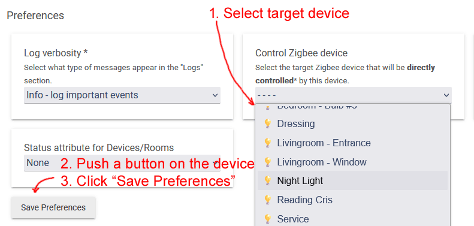
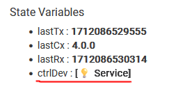
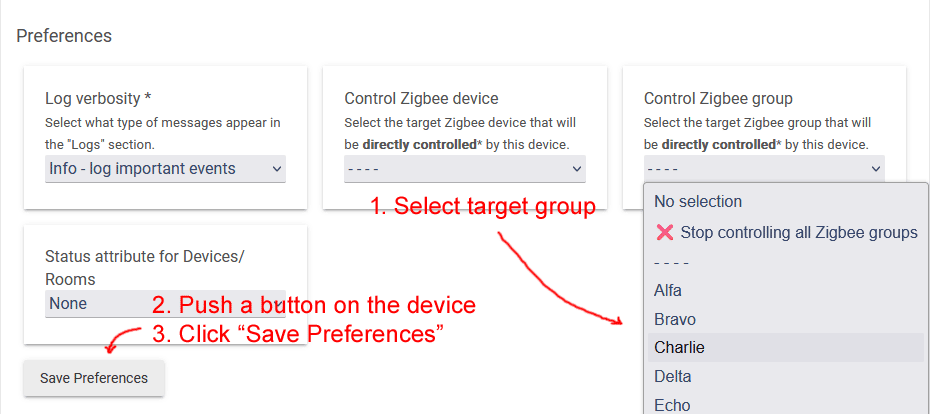
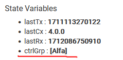
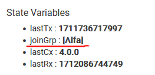

# Zigbee Bindings

Quick jump to:

* [Introduction](#introduction)
* [Centralized Hub Communication](#centralized-hub-communication)
* [Direct Device-to-Device Bindings](#direct-device-to-device-bindings)
* [Direct Group Bindings](#direct-group-bindings)

## Introduction

In a smart home ecosystem, devices can interact via three distinct methods:

1. **Centralized Hub Communication**: This method employs the hub as a central point of communication. The hub receives events from devices, processes them, and issues commands based on predefined automation rules and workflows.
2. **Direct Device-to-Device Bindings**: This approach allows for direct communication between devices. By establishing a direct binding, devices can interact with each other autonomously, facilitating instantaneous command execution without necessitating hub mediation.
3. **Direct Group Bindings**: Similar to direct device bindings, this method enables communication to Zigbee groups. Instead of individual devices, messages are directed to predefined groups, allowing for simultaneous command dissemination to multiple devices within the group.

These methods ensure flexible and efficient communication within your smart home network, catering to various operational needs and preferences.

## Centralized Hub Communication
Centralized Hub Communication serves as the foundational interaction model within smart home systems. This paradigm ensures that all device interactions are coordinated through the hub:

```
┌─────────────┐          ┌───────────┐        ┌────────────┐
│Motion Sensor│          │Hubitat Hub│        │Light Switch│
└──────┬──────┘          └─────┬─────┘        └─────┬──────┘
       │                       │                    │       
       │                       │                    │       
       │     Report event      │                    │       
       │   [motion detected]   │                    │       
       │                       │                    │       
       │──────────────────────>│                    │       
       │                       │                    │       
       │                       │                    │       
       │                       │    Send command    │       
       │                       │      [turn on]     │       
       │                       │                    │       
       │                       │───────────────────>│       
┌──────┴──────┐          ┌─────┴─────┐        ┌─────┴──────┐
│Motion Sensor│          │Hubitat Hub│        │Light Switch│
└─────────────┘          └───────────┘        └────────────┘
```

The process unfolds as follows:

1. The **Motion Sensor** detects movement and relays this event to the **Hubitat Hub**.
1. The **Hubitat Hub** consults its suite of applications, such as Rule Machine, Button Controller, and Room Lighting, to determine if an automation task is triggered by the reported event.
1. Upon identifying a relevant automation task, the **Hubitat** Hub executes the associated actions. In the example provided, it issues a "turn on" command to the **Light Switch**.

Advantages:
* Enables the creation of sophisticated and robust automation tasks within the Hubitat Hub.
* Centralizes all automation tasks, simplifying management and oversight.
* Facilitates backup and seamless migration of automation tasks to a new Hubitat Hub.

Disadvantages:
* Dependency on the **Hubitat Hub**'s availability; automations cease to function if the hub is offline.
* Increased response times, as all communications necessitate passage through the Hubitat Hub.

## Direct Device-to-Device Bindings

Direct Device-to-Device Bindings leverage the inherent capabilities of the Zigbee protocol to facilitate seamless communication between devices. This method bypasses the need for a central hub, enabling devices to interact directly through a process known as "binding". In this setup, a source device is directly linked to a target device, establishing a new streamlined communication channel.

```
┌─────────────┐          ┌───────────┐┌────────────┐
│Motion Sensor│          │Hubitat Hub││Light Switch│
└──────┬──────┘          └─────┬─────┘└─────┬──────┘
       │                       │            │       
       │                       │            │       
       │     Report event      │            │       
       │   [motion detected]   │            │       
       │                       │            │       
       │──────────────────────>│            │       
       │                       │            │       
       │                       │            │       
       │     Send command      |            │       
       │       [turn on]       |            │       
       │                       │            │       
       │───────────────────────────────────>│       
┌──────┴──────┐          ┌─────┴─────┐┌─────┴──────┐
│Motion Sensor│          │Hubitat Hub││Light Switch│
└─────────────┘          └───────────┘└────────────┘
```

The operational flow is as follows:

1. The **Motion Sensor** detects motion and informs the **Hubitat Hub** of the event.
1. Concurrently, the **Motion Sensor** issues a "turn on" command directly to the **Light Switch**, initiating immediate action.

Advantages:
* Enhanced response times due to the elimination of hub-based message routing.
* Improved reliability, with devices capable of interacting independently of hub status.

Disadvantages:
* Automation tasks are distributed across various devices, potentially complicating troubleshooting processes.
* Device resets result in the loss of Zigbee bindings, necessitating reconfiguration.
* Compatibility limitations, as not all Zigbee devices support direct binding capabilities.

### Configuring Direct Device-to-Device Bindings

The bindings configuration must be executed on the device issuing commands, such as buttons and sensors.

The following devices support the direct device-to-device bindings feature:

* Parasoll Door/Window Sensor (E2013): On/Off
* Rodret Dimmer (E2201): On/Off and Brightness
* Styrbar Remote Control N2 (E2002): On/Off and Brightness
* Symfonisk Sound Remote Gen2 (E2123): On/Off
* Tradfri On/Off Switch (E1743): On/Off
* Tradfri Open/Close Remote (E1766): Window Covering
* Tradfri Motion Sensor (E1745): On/Off
* Tradfri Remote Control (E1810): On/Off and Brightness
* Tradfri Shortcut Button (E1812): On/Off
* Vallhorn Motion Sensor (E2134): On/Off

Follow this steps in order to setup device-to-device bindings:

1. Navigate to the device's details page.
1. Within the Preferences section, select the desired target device for direct control.
1. Wake up the source device (e.g. push a button).
1. Immediately click the "Save Preferences" button.
1. The setup is complete! The source device will now directly control the target device, bypassing the need for Hubitat Hub programming.



Note: After clicking the "Save Preferences" button, you need to reload the device details page in order to see the newly bound device in the "State Variables" section (the page is rendered before the device bind confirmation is received):



## Direct Group Bindings

Direct Group Bindings in Zigbee networks offer a sophisticated method of communication, where devices are not only members of a Zigbee Group but also capable of issuing commands to the entire group simultaneously. This advanced feature allows for a streamlined and efficient operation within a smart home network.

```
┌─────────────┐          ┌───────────┐┌───────────────┐┌───────────────┐
│Motion Sensor│          │Hubitat Hub││Light Switch #1││Light Switch #2│
└──────┬──────┘          └─────┬─────┘└───────┬───────┘└───────┬───────┘
       │                       │              │                │        
       │                       │              │                │        
       │     Report event      │              │                │        
       │   [motion detected]   │              │                │        
       │                       │              │                │        
       │──────────────────────>│              │                │        
       │                       │              │                │        
       │                       │              │                │        
       │    Broadcast command  |              │                │        
       │       [turn on]       │              │                │        
       │                       │              │                │        
       │─────────────────────────────────────>│                │        
       │                       │              │                │        
       │                       │              │                │        
       │    Broadcast command  |              │                │        
       │       [turn on]       |              │                │        
       │                       │              │                │        
       │──────────────────────────────────────────────────────>│        
┌──────┴──────┐          ┌─────┴─────┐┌───────┴───────┐┌───────┴───────┐
│Motion Sensor│          │Hubitat Hub││Light Switch #1││Light Switch #2│
└─────────────┘          └───────────┘└───────────────┘└───────────────┘
```

The sequence of operations is as follows:

1. The **Motion Sensor** reports the detection of motion to the **Hubitat Hub**.
1. Simultaneously, the **Motion Sensor** broadcasts a "turn on" command to the **Zigbee Group**.
1. All devices within the group receive the "turn on" command concurrently, ensuring synchronized action.

Advantages:
* Inherits all the benefits of Direct Device Bindings.
* Enables simultaneous control over multiple devices.

Disadvantages:
* Shares the same limitations as Direct Device Bindings.
* Group messages are broadcasted across the Zigbee mesh, potentially leading to increased network traffic and the risk of congestion.

### Configuring Direct Group Bindings

To ensure proper configuration, direct group bindings must be executed on the command-issuing device, typically buttons and sensors.

Supported Devices for Direct Group Bindings:

* Parasoll Door/Window Sensor (E2013): On/Off
* Rodret Dimmer (E2201): On/Off and Brightness
* Tradfri Motion Sensor (E1745): On/Off
* Symfonisk Sound Remote Gen2 (E2123): On/Off
* Vallhorn Motion Sensor (E2134): On/Off

Steps for setting Up Device-to-Device Bindings:

1. Navigate to the device's details page.
1. Within the Preferences section, select the desired target group for direct control.
1. Wake up the source device (e.g. push a button).
1. Immediately click the "Save Preferences" button.
1. The setup is complete! Button presses will now directly control all devices in the target group, bypassing the need for programming on the Hubitat Hub.



Note: After clicking the "Save Preferences" button, you need to reload the device details page in order to see the newly bound group in the "State Variables" section (the page is rendered before the group bind confirmation is received):



### Joining a Group

Devices eligible for group membership:

* Askvader On/Off Switch (E1836)
* LED Driver (ICPSHC24)
* Tradfri Control Outlet (E1603, E1706)
* Steps to Add Devices to a Group:

Steps for joining a group:

1. Access the device details page for any IKEA main-powered device.
1. In the Preferences section, choose a group to join.
1. Select the "Save Preferences" button.
1. The process is complete! The device will now receive commands sent to the group.


Note: After clicking the "Save Preferences" button, you need to reload the device details page in order to see the newly joined group in the "State Variables" section (the page is rendered before the group join confirmation is received):



---
[](https://www.buymeacoffee.com/dandanache)
