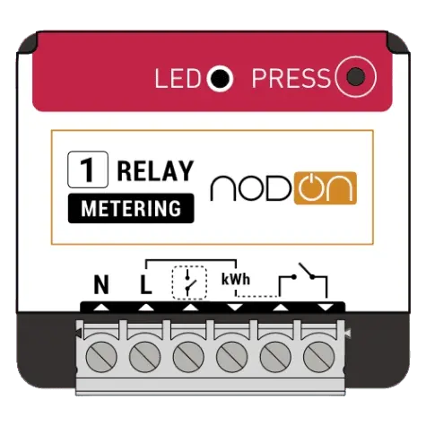
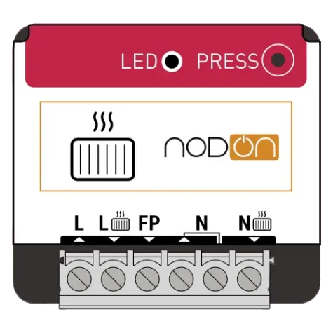
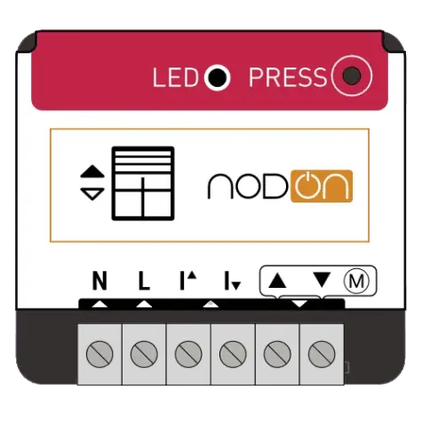

# Hubitat drivers for NodOn smart devices

## About NodOn

NodOn® is a French company specialized in Smart Home / Smart Building radio devices. They design, engineer and manufacture products (own brand, OEM/ODM) to make homes and buildings smarter, simply and rapidly, through cutting edge technologies.

## Drivers for Hubitat

These drivers enable advanced features and functionalities for the following NodOn smart devices:

* [NodOn Multifunction Relay Switch (SIN-4-1-20)](#nodon-multifunction-relay-switch-sin-4-1-20)
* [NodOn Relay Switch with Metering (SIN-4-1-21)](#nodon-relay-switch-with-metering-sin-4-1-21)
* [NodOn Lighting Relay Switch (SIN-4-2-20)](#nodon-lighting-relay-switch-sin-4-2-20)
* [NodOn Pilot Wire Heating Module (SIN-4-FP-21)](#nodon-pilot-wire-heating-module-sin-4-fp-21)
* [NodOn Roller Shutter Relay Switch (SIN-4-RS-20)](#nodon-roller-shutter-relay-switch-sin-4-rs-20)

## Installation
There are two ways to install the drivers: using Hubitat Package Manager (HPM) or manually importing the driver code.

### HPM Installation (Recommended)
HPM is an app that allows you to easily install and update custom drivers and apps on your Hubitat hub. To use HPM, you need to have it installed on your hub first. See the [HPM Documentation](https://hubitatpackagemanager.hubitatcommunity.com/) for installation and usage instructions.

Once you have HPM installed on your Hubitat hub, follow these steps to install the NodOn drivers:

1. In the Hubitat interface, go to **Apps** and select **Hubitat Package Manager**.
1. Select **Install**, then **Search by Keywords**.
1. Enter **Hubitat drivers for NodOn smart devices** in the search box and click **Next**.
1. Select **Hubitat drivers for NodOn smart devices by Dan Danache** and click **Next**.
1. Select the driver(s) you need from the dropdown list and follow the install instructions.

### Manual Installation
If you don't want to use HPM, you can also install the drivers manually by importing the driver code from GitHub. Follow these steps to do so:

1. In the Hubitat interface, go to **Drivers Code**.
1. Click **New Driver** in the top right, then click **Import** in the top right.
1. Search below for your device, look for the **Manual install file** property and enter it in the URL field.
1. Click **Import**, then click **OK** and the code should load in the editor.
1. Click **Save** in the top right.

More info about installing custom drivers is available in the [Hubitat Official Documentation](https://docs2.hubitat.com/en/how-to/install-custom-drivers).

### NodOn Multifunction Relay Switch (SIN-4-1-20)

| Parameter | Details |
|-----------|---------|
| Name | Zigbee Multifunction Relay Switch |
| Image |  |
| Manual install file | `https://raw.githubusercontent.com/dan-danache/hubitat/master/nodon-drivers/NodOn_SIN-4-1-20.groovy` |
| Official documentation | [Overview](https://nodon.fr/en/nodon/zigbee-multifunction-relay-switch/?portfolioCats=369)｜[Datasheet](https://nodon.fr/wp-content/uploads/2021/04/NodOn_Zigbee_MultifunctionRelaySwitch_SIN-4-1-20-Datasheet_EN.pdf)｜[User Guide](https://nodon.fr/wp-content/uploads/2021/04/SIN-4-1-20-UG_FR_EN-V6_digital.pdf) |
| Tested firmwares | 3.0.0-1.4.4 (128B-010A-00010404) |
| Since version | 1.0.0 |

#### Features
* **Command Controls**: Includes "On", "Off", "Toggle", and "On with Timed Off" commands.
* **Power Outage Configuration**: Configures the state after a power outage (options include "Power On", "Power Off", and "Restore previous state").
* **Impulse Mode Configuration**: Puts relay into Impulse Mode to control your gate / garage door / electric latch.
* **Button Events**: Supports "Push" events for the attached switch (optional, if wired).
* **Health Status**: Indicates whether the device is online or offline.
* **Device State Refresh**: Refreshes the device state on demand for real-time status updates.
* **Zigbee Group Membership**: The device can be a member of Zigbee groups. This allows for efficient management of multiple devices.

#### Pairing Instructions
1. If the device is already powered on, power it off for 20 seconds (power-cycle) before each pairing attempt.
1. When powered, the relay switch LED will blink orange, looking to join a Zigbee network.
1. If LED is not blinking orange, reset the device: Press more than 5 seconds on the relay's button. The LED blinks orange. Press the button again (short press) to validate the reset. If the reset is successful, the LED flashes red and green alternately, then flashes orange. Repeat if necessary.
1. In the Hubitat interface, navigate to **Devices**, click **Add Device** in the top right corner, select **Zigbee**, and then click **Start Zigbee Pairing**.
1. Return to the pairing page, provide a name for your device, and assign it to a room.
1. You're all set! Enjoy using your NodOn Multifunction Relay.

### NodOn Relay Switch with Metering (SIN-4-1-21)

| Parameter | Details |
|-----------|---------|
| Name | Zigbee Multifunction Relay Switch with Metering |
| Image |  |
| Manual install file | `https://raw.githubusercontent.com/dan-danache/hubitat/master/nodon-drivers/NodOn_SIN-4-1-21.groovy` |
| Official documentation | [Overview](https://nodon.fr/en/nodon/zigbee-multifunciton-relay-switch-with-metering/?portfolioCats=369)｜[Datasheet](https://nodon.fr/wp-content/uploads/2024/03/SIN-4-1-21-NodOn_Datasheet_V1_EN.pdf)｜[User Guide](https://nodon.fr/wp-content/uploads/2024/03/SIN-4-1-21-UG-FR-EN-V3-digital.pdf) |
| Tested firmwares | 3.0.0-1.4.4 (128B-0105-00010404) |
| Since version | 1.0.0 |

#### Features
* **Command Controls**: Includes "On", "Off", "Toggle", and "On with Timed Off" commands.
* **Power Reporting**: Reports the current power demand (in Watts).
* **Energy Consumption Reporting**: Reports the total consumed energy (in kWh).
* **Power Outage Configuration**: Configures the state after a power outage (options include "Power On", "Power Off", and "Restore previous state").
* **Impulse Mode Configuration**: Puts relay into Impulse Mode to control your gate / garage door / electric latch.
* **Button Events**: Supports "Push" events for the attached switch (optional, if wired).
* **Health Status**: Indicates whether the device is online or offline.
* **Device State Refresh**: Refreshes the device state on demand for real-time status updates.
* **Zigbee Group Membership**: The device can be a member of Zigbee groups. This allows for efficient management of multiple devices.

#### Pairing Instructions
1. If the device is already powered on, power it off for 20 seconds (power-cycle) before each pairing attempt.
1. When powered, the relay switch LED will blink orange, looking to join a Zigbee network.
1. If LED is not blinking orange, reset the device: Press more than 5 seconds on the relay's button. The LED blinks orange. Press the button again (short press) to validate the reset. If the reset is successful, the LED flashes red and green alternately, then flashes orange. Repeat if necessary.
1. In the Hubitat interface, navigate to **Devices**, click **Add Device** in the top right corner, select **Zigbee**, and then click **Start Zigbee Pairing**.
1. Return to the pairing page, provide a name for your device, and assign it to a room.
1. You're all set! Enjoy using your NodOn Multifunction Relay.

### NodOn Lighting Relay Switch (SIN-4-2-20)

| Parameter | Details |
|-----------|---------|
| Name | Zigbee Lighting Relay Switch |
| Image |  |
| Manual install files (2) | `https://raw.githubusercontent.com/dan-danache/hubitat/main/nodon-drivers/component/NodOn_ComponentRelaySwitch.groovy` `https://raw.githubusercontent.com/dan-danache/hubitat/master/nodon-drivers/NodOn_SIN-4-2-20.groovy` |
| Official documentation | [Overview](https://nodon.fr/en/nodon/zigbee-on-off-lighting-relay-switch/?portfolioCats=369)｜[Datasheet](https://nodon.fr/wp-content/uploads/2021/04/NodOn_Zigbee_ON-OFF-LightingRelaySwitch_SIN-4-2-20_Datasheet_EN.pdf)｜[User Guide](https://nodon.fr/wp-content/uploads/2021/04/SIN-4-2-20-UG_FR_EN-V6_digital.pdf) |
| Tested firmwares | 128B-0102-00010102 |
| Since version | 1.0.0 |

#### Features
* **Command Controls**: Includes "On", "Off", "Toggle", and "On with Timed Off" commands for each relay.
* **Power Outage Configuration**: Configures the state after a power outage (options include "Power On", "Power Off", and "Restore previous state") for each relay.
* **Button Events**: Supports "Push" events for both attached switches (optional, if wired).
* **Health Status**: Indicates whether the device is online or offline.
* **Device State Refresh**: Refreshes the device state on demand for real-time status updates.

#### Pairing Instructions
1. If the device is already powered on, power it off for 20 seconds (power-cycle) before each pairing attempt.
1. When powered, the relay switch LED will blink orange, looking to join a Zigbee network.
1. If LED is not blinking orange, reset the device: Press more than 5 seconds on the relay's button. The LED blinks orange. Press the button again (short press) to validate the reset. If the reset is successful, the LED flashes red and green alternately, then flashes orange. Repeat if necessary.
1. In the Hubitat interface, navigate to **Devices**, click **Add Device** in the top right corner, select **Zigbee**, and then click **Start Zigbee Pairing**.
1. Return to the pairing page, provide a name for your device, and assign it to a room.
1. You're all set! Enjoy using your NodOn Lighting Relay Switch.

### NodOn Pilot Wire Heating Module (SIN-4-FP-21)

| Parameter | Details |
|-----------|---------|
| Name | Zigbee Pilot Wire Heating Module |
| Image |  |
| Manual install file | `https://raw.githubusercontent.com/dan-danache/hubitat/master/nodon-drivers/NodOn_SIN-4-FP-21.groovy` |
| Official documentation | [Overview](https://nodon.fr/en/nodon/zigbee-pilote-wire-heating-module/?portfolioCats=369)｜[Datasheet](https://nodon.fr/wp-content/uploads/2024/01/SIN-4-FP-21-NodOn_Datasheet_V1_EN.pdf)｜[User Guide](https://nodon.fr/wp-content/uploads/2023/11/SIN-4-FP-21-UG-FR-EN-V5_digital.pdf) |
| Tested firmwares | 3.0.0-1.4.4 (128B-0106-00010404) |
| Since version | 1.0.0 |

#### Features
* **Pilot Wire Controls**: Includes "Off", "Anti-Freeze", "Eco", "Comfort", "Comfort-1", and "Comfort-2" modes.
* **Power Reporting**: Reports the current power demand (in Watts).
* **Energy Consumption Reporting**: Reports the total consumed energy (in kWh).
* **Health Status**: Indicates whether the device is online or offline.
* **Device State Refresh**: Refreshes the device state on demand for real-time status updates.

#### Pairing Instructions
1. If the device is already powered on, power it off for 20 seconds (power-cycle) before each pairing attempt.
1. When powered, the relay switch LED will blink orange, looking to join a Zigbee network.
1. If LED is not blinking orange, reset the device: Press more than 5 seconds on the relay's button. The LED blinks orange. Press the button again (short press) to validate the reset. If the reset is successful, the LED flashes red and green alternately, then flashes orange. Repeat if necessary.
1. In the Hubitat interface, navigate to **Devices**, click **Add Device** in the top right corner, select **Zigbee**, and then click **Start Zigbee Pairing**.
1. Return to the pairing page, provide a name for your device, and assign it to a room.
1. You're all set! Enjoy using your NodOn Pilot Wire Heating Module.

### NodOn Roller Shutter Relay Switch (SIN-4-RS-20)

| Parameter | Details |
|-----------|---------|
| Name | Zigbee Roller Shutter Relay Switch |
| Image |  |
| Manual install file | `https://raw.githubusercontent.com/dan-danache/hubitat/master/nodon-drivers/NodOn_SIN-4-RS-20.groovy` |
| Official documentation | [Overview](https://nodon.fr/en/nodon/zigbee-roller-shutter-relay-switch/?portfolioCats=369)｜[Datasheet](https://nodon.fr/wp-content/uploads/2022/02/NodOn_Zigbee_RollerShutterModule_SIN-4-RS-20-Datasheet_EN.pdf)｜[User Guide](https://nodon.fr/wp-content/uploads/2021/04/SIN-4-RS-20-UG_FR_EN-V6_digital.pdf) |
| Tested firmwares | 3.0.0-1.3.0 (128B-0109-00010300) |
| Since version | 1.0.0 |

#### Features
* **Roller Shutter Controls**: Includes "Open", "Close", "SetPosition", "StartPositionChange", and "StopPositionChange" commands.
* **Button Events**: Supports "Push" events for both attached switches (optional, if wired).
* **Health Status**: Indicates whether the device is online or offline.
* **Device State Refresh**: Refreshes the device state on demand for real-time status updates.

#### Pairing Instructions
1. If the device is already powered on, power it off for 20 seconds (power-cycle) before each pairing attempt.
1. When powered, the relay switch LED will blink orange, looking to join a Zigbee network.
1. If LED is not blinking orange, reset the device: Press more than 5 seconds on the relay's button. The LED blinks orange. Press the button again (short press) to validate the reset. If the reset is successful, the LED flashes red and green alternately, then flashes orange. Repeat if necessary.
1. In the Hubitat interface, navigate to **Devices**, click **Add Device** in the top right corner, select **Zigbee**, and then click **Start Zigbee Pairing**.
1. Return to the pairing page, provide a name for your device, and assign it to a room.
1. You're all set! Enjoy using your NodOn Roller Shutter Relay Switch.

---

