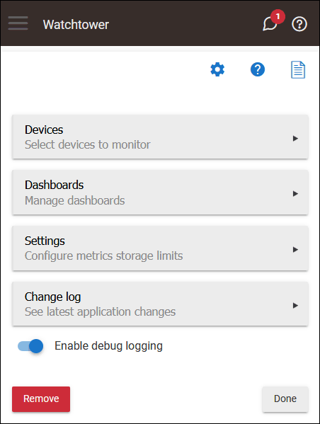
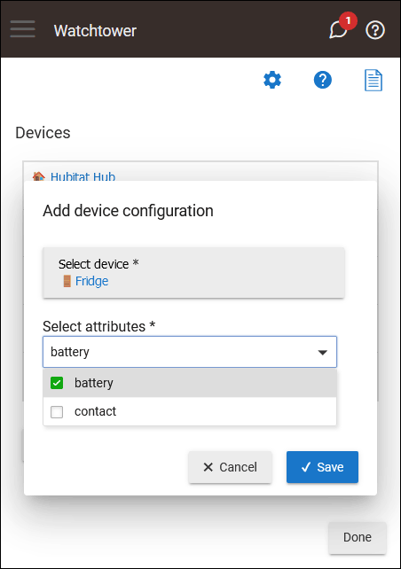
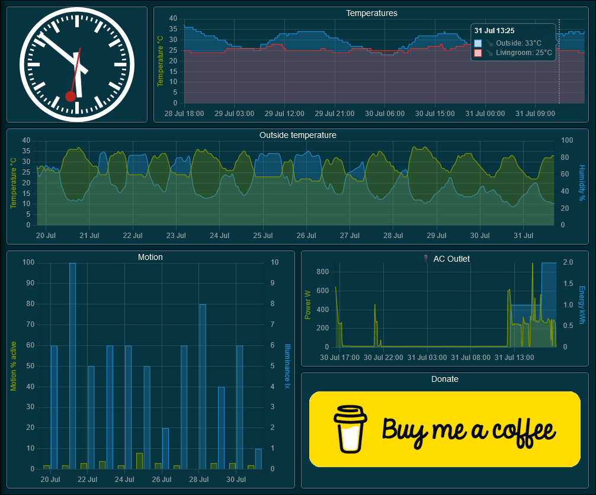

# Watchtower

"Data-Driven Insights for a Smarter Home"

Watchtower is a Hubitat application designed to monitor and record device attributes at various time resolutions, ensuring efficient long-term data retention.

Utilizing a fixed-size database akin to a Round-Robin Database (RRD), Watchtower captures high-resolution data every five minutes, which then degrades into hourly, daily, and weekly averages. This method allows users to maintain a comprehensive historical record of their smart devices' performance without overwhelming storage capacities.

Users can configure which devices and attributes to monitor, and the application automatically reads and stores these values in CSV files, making it easy to access and analyze the collected data.

In addition to robust data collection, Watchtower offers customizable dashboards for visualizing device metrics. Dashboards can render various types of tiles, such as device charts, attribute comparisons, text/HTML, and iframes.

Watchtower provides a reliable solution for long-term smart home monitoring and data visualization.

## Installation

To install the Watchtower app using the Hubitat Package Manager (and receive automatic updates), follow these steps:

1. Go to the **Apps** menu in the Hubitat interface.
2. Select **Hubitat Package Manager** from the list of apps.
3. Click **Install** and then **Search by Keywords**.
4. Type **Watchtower** in the search box and click **Next**.
5. Choose **Watchtower by Dan Danache** and click **Next**.
6. Read the license agreement and click **Next**.
7. Wait for the installation to complete and click **Next**.
8. Go back to the **Apps** menu in the Hubitat interface.
9. Click the **Add user app** button in the top right corner.
10. Select **Watchtower** from the list of apps.

## Metrics Collection

The application utilizes a fixed-size database, similar in design and purpose to an RRD (Round-Robin Database). This setup allows for high-resolution data (minutes per point) to gradually degrade into lower resolutions for long-term retention of historical data.

The following time resolution are used:

- **5 minutes**: Attribute value in the last 5 minutes
- **1 hour**: Average attribute value over the last hour
- **1 day**: Average attribute value over the last day
- **1 week**: Average attribute value over the last week

### How it Works

1. **Every 5 minutes**: The application reads the current value for all configured device attributes and stores this data in the File Manager using CSV files named `wt_${device_id}_5m.csv`, one file per configured device. Only devices configured in the application's **Devices** screen are queried.

1. **At the start of every hour**: The application reads the data from each device's `wt_${device_id}_5m.csv` file, selects records from the last hour, calculates the averages, and saves them in CSV files named `wt_${device_id}_1h.csv`.

1. **At midnight daily**: The application reads the data from each device's `wt_${device_id}_5m.csv` file, selects records from the last day (00:00 - 23:59), calculates the averages, and saves them in CSV files named `wt_${device_id}_1d.csv`.

1. **At midnight every Sunday**: The application reads the data from each device's `wt_${device_id}_1h.csv` file, selects records from the last week (Monday 00:00 - Sunday 23:59), calculates the averages, and saves them in CSV files named `wt_${device_id}_1w.csv`.

**Important**: To maintain a fixed file size, old records are discarded during each save, as specified in the **Settings** screen.

## Usage

To use the Watchtower app, follow these steps:

1. Go to the **Apps** menu in the Hubitat interface.
2. Select **Watchtower** from the list of apps.

### Main Screen

When you open the Watchtower app, the following screen will welcome you.

### Devices Screen

On this screen, you can configure which smart devices will be monitored by the Watchtower app.

Click the **Add device** button to start monitoring a new device. You will be prompted to select a device and then select what device attributes (from device Current State) you want to monitor.

**Note**: Not all device attributes are supported. Only the [official attributes](https://docs2.hubitat.com/en/developer/driver/capability-list) will be available for selection.

Click the **Done** button on the bottom-right to return back to the main screen.

After you click the **Save** button, the application will start to periodically (every 5 minutes) save the selected attributes in a CSV file that you can download from the **File Manager**.

Links to the CSV files are available from the **View device** screen.

From this screen, you also have the option to remove the device configuration. Once you click the **Remove** button, the application will stop collecting metrics for this device. The CSV files are also removed from the **File Manager**.

### Dashboards Screen

From the dashboards screen, you can add, rename and delete dashboards for the configured devices. Clicking the dashboard name, will open the specified dashboard in a new tab and you can add and remove tiles for the selected dashboard.

Click the **Done** button on the bottom-right to return back to the main screen.

### Settings Screen

From the settings screen, you can configure how long the collected metrics are stored for each time resolution.

**Warning**: Changing the "max record" settings will directly impact the CSV files size for every configured device. Loading of dashboard tiles will also be slower if you increase the default values since more data needs to be downloaded from the hub.

Click the **Done** button on the bottom-right to save the configuration and return back to the main screen.

## Dashboard Configuration

When you load a dashboard in a new tab for the first time (by clicking the dashboard name in the Watchtower app), a blank screen will appear where you can add dashboard tiles.

**Note**: If you have just configured new monitored devices in the Watchtower app, there may not be enough data collected to display on the dashboard tiles. If a chart displays the **No data yet** message, don't worry. Simply check back later (e.g., in a day or two) to allow the application to collect sufficient data points.

### Dashboard Menu

The dashboard menu is not displayed by default and will only appear when the dashboard has no tiles. To toggle the dashboard menu, press the backtick (`` ` ``) key on your keyboard. On mobile devices, you can bring up the menu by swiping from the left margin of the screen.

From the dashboard menu on the left, you can add a new dashboard tile, save the current dashboard layout, or configure the auto-refresh interval.

**Important**: Changes to the dashboard layout are not saved automatically! When you are satisfied with the dashboard layout, you must click the **Save dashboard** button.

### Supported Dashboard Tiles

The following dashboard tile types are currently supported:

- **Device** - Renders a chart with one or two attributes for a selected device. If you select a second attribute, its scale is shown on the right side of the chart.

   Example usage: chart temperature and humidity for a specific device.

   

- **Attribute** - Renders a chart with the selected attribute, from multiple devices.

   Example usage: chart temperature from 2 devices (inside vs. outside).

   

- **Text** - This tile type renders plain or HTML text.

   Example usage: add a navigation tile with links to other dashboards (using HTML code).

   

- **Iframe** - This tile type renders an embedded website from a specified URL. The iframe contents are refreshed according to the configured auto-refresh interval.

   Example usage: load a widget from another location.

   

### Manage Dashboard Tiles

- Move tiles around by dragging on their title. Resize tiles by dragging on the bottom-right resize handler.

- Remove a dashboard tile by dragging it outside the dashboard grid.

- Dashboard tiles cannot be edited. If you selected the wrong device/attribute or want to change the tile title, remove it and add it again with the correct configuration.

> **Important**: Changes are not automatically saved! Don't forget to click the **Save dashboard** button when you are satisfied with the dashboard layout.

### Auto-refresh

Using the left dashboard menu, select the desired auto-refresh interval.

### Themes Support
Dashboards can be configured to use a light or dark theme. You can change the theme from the left dashboard menu.

---

