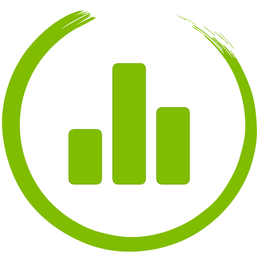
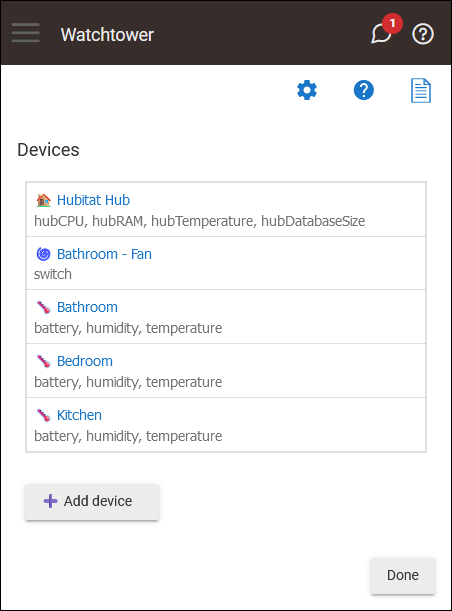
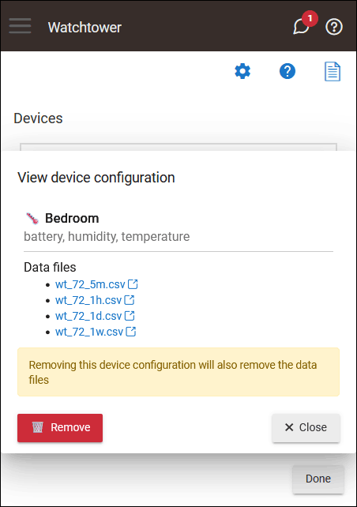
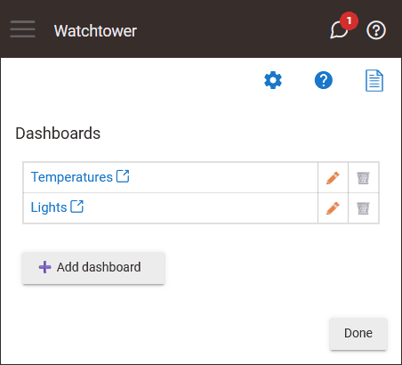
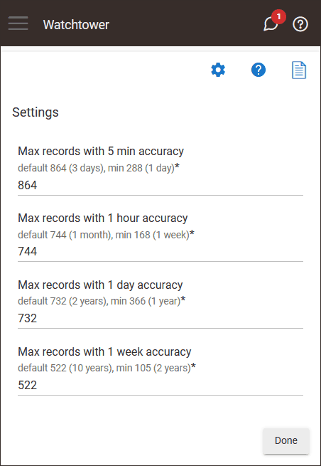

# Watchtower

Build dashboards for your smart devices.

## Installation

To install the Watchtower app using the Hubitat Package Manager (and receive automatic updates), follow these steps:

1. Go to the **Apps** menu in the Hubitat interface.
2. Select **Hubitat Package Manager** from the list of apps.
3. Click **Install** and then **Search by Keywords**.
4. Type **Watchtower** in the search box and click **Next**.
5. Choose **Watchtower by Dan Danache** and click **Next**.
6. Read the license agreement and click **Next**.
7. Wait for the installation to complete and click **Next**.
8. Go back to the **Apps** menu in the Hubitat interface.
9. Click the **Add user app** button in the top right corner.
10. Select **Watchtower** from the list of apps.

## Usage

To use the Watchtower app, follow these steps:

1. Go to the **Apps** menu in the Hubitat interface.
2. Select **Watchtower** from the list of apps.

## Usage

### Main screen

When you open the Watchtower app, the following screen will welcome you.

### Devices screen

On this screen, you can configure which devices will be monitored by the Watchtower app.

Click the **Add device** button to start monitoring a new device. You will be prompted to select a device and then select what device attributes you want to monitor.

Note: Not all device attributes are supported. Only [the official attributes](https://docs2.hubitat.com/en/developer/driver/capability-list) will be available for selection.

Click the **Done** button on the bottom-right to return back to the main screen.

After you click the **Save** button, the application will start to periodically (every 5 minutes) save the selected attributes in a CSV file that you can download from the File Manager.

Links to the CSV files are available from the **View device** screen.

From this screen, you also have the option to remove the device configuration. Once you click the **Remove** button, the application will stop collecting metrics for this device. The CSV files are also removed from the File Manager.

### Dashboards screen

From the dashboards screen, you can add, rename and delete dashboards for the configured devices. Clicking the dashboard name, will open the specified dashboard in a new tab and you can add and remove panels for the selected dashboard.

Click the **Done** button on the bottom-right to return back to the main screen.

### Settings screen

The application uses a fixed-size database, similar in design and purpose to RRD (round-robin-database). It allows for higher resolution (minutes per point) of recent data to degrade into lower resolutions for long-term retention of historical data.

The following data resolution are used:
- 5 minutes
- 1 hour
- 1 day
- 1 week

From the settings screen, you can configure how long the collected metrics are stored for each resolution.

Click the **Done** button on the bottom-right to save the configuration and return back to the main screen.

## Dashboard configuration

The first time you load a dashboard in a new tab (by clicking the dashboard name in the Watchtower app), a blank screen will appear when you can add dashboard pannels.

> **Note**: If you just configured new monitored devices from the Watchtower app, there is not enough data collected to display on the dashboard panels. Don't worry if a chart is displaying the **No data yet** message, just come back later (e.g. a day or two) to allow the application to collect enough datapoints.

### Dashboard menu

The dashboard menu is not displayed by default. It will show only when the dashboard has no panels. To toggle the dashboard menu, press the backtick (`` ` ``) key on your keyboard. This means that dashboards cannot be configured from a mobile device.

From the dashboard menu on the left, you can add a new dashboard panel, save the current dashbodard layout or configure the auto-refresh interval.

> Important: Changes to the dashboard layout are not saved automatically! When you are happy with the dashboard layout, you must click the **Save dashboard** button (from the dashboard left menu).

### Supported panels

The following dashboard panel types are currently supported:

- **Text** - This panel type renders plain or HTML text.

   

- **Device** - This panel type renders a chart with one or two attributes for a selected device. If you select two attributes, its scale is shown on the right side of the chart.

   

- **Attribute** - This panel type renders a chart with the selected attribute, from multiple devices.

   

### Move and resize panels

Move panels around by dragging on their title. Resize panels by dragging on the bottom-right resize handler.

### Remove panels

To remove a dashboard panel, just drag it outside the dashboard grid.

### Edit panels

Dashboard panels cannot be edited. If you picked the wrong device / attribute or want to change the panel title, just remove it and add it again with the correct configuration.

**Important**: Don't forget to save your dashboard after you get it right!

### Themes
Dashboards can be configured to use a light or dark theme:

You can change the theme either by editing the dashboard URL (the `dark=true` or `dark=false` bit at the end of the URL), or from the Watchtower app's main screen (the **Use dark theme** switch at the bottom).

---

