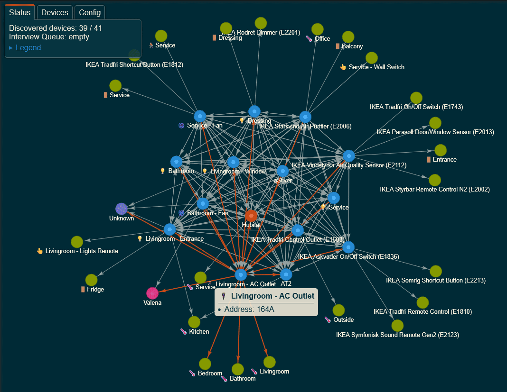

# Hubitat Zigbee Map

This application allows you to visualize the topology and connectivity of your Zigbee network.

## Installation

If you have already installed the **Hubitat Package Manager** app on your Hubitat hub, you can use it to install the **Zigbee Map** app and receive automatic updates. To install the Zigbee Map app using the Hubitat Package Manager, follow these steps:

1. Go to the **Apps** menu in the Hubitat interface.
2. Select **Hubitat Package Manager** from the list of apps.
3. Click **Install** and then **Search by Keywords**.
4. Type **Zigbee Map** in the search box and click **Next**.
5. Choose **Zigbee Map by Dan Danache** and click **Next**.
6. Read the license agreement and click **Next**.
7. Wait for the installation to complete and click **Next**.
8. Go back to the **Apps** menu in the Hubitat interface.
9. Click the **Add user app** button in the top right corner.
10. Select **Zigbee Map** from the list of apps.

## Usage

To use the Zigbee Map app, follow these steps:

1. Go to the **Apps** menu in the Hubitat interface.
2. Select **Zigbee Map** from the list of apps.
3. Click the **View Zigbee map** option.
4. Watch the app build the map of your Zigbee network.
5. The map is ready when the Interview Queue is empty.

## How it works
Each Zigbee device keeps a list of other devices that are within direct radio range. This list is called the "Neighbors Table".

The Neighbors Table helps the device to discover and maintain routes to other devices on the Zigbee network. The Neighbors Table also stores information about the device type, relationship, capability, and link quality of each neighbor. This information is used to optimize the network performance and reliability.

The Zigbee Map application allows you to visualize the topology and connectivity of your Zigbee network. It works by first querying each device in the network for its Neighbors List. It then combines all the responses and displays a graph with nodes representing devices and edges representing links. The map reflects the current state of the Zigbee network, as the data is gathered in real time.

Data collection process:

1. When you launch the HTML application, it requests the Neighbors Table from the Zigbee Coordinator (Hubitat hub), which contains the list of devices that are directly connected to the hub and their link quality.

1. The application then adds all the neighbors to an **Interview Queue**, which ensures that only one device is queried at a time.

1. The application repeats this process for each device in the queue, asking for its neighbors and adding them to the queue, until all devices are interviewed and the queue is empty.

> **Important**: Be patient; each interview require multiple interactions between the application and the device, so getting the full neighbors list for a single Zigbee device might take up-to 20 seconds.

## Additional notes

- Some Zigbee Router devices may not comply with the Zigbee specification and fail to provide their Neighbors List when requested. These devices are not recommended for use in your Zigbee network.

- The application waits for 25 seconds for each device to respond to the interview request. If there is no response, the device is marked as unresponsive and the application moves on to the next device in the queue.

- Zigbee End Devices (typically battery-powered devices that enter sleep mode to conserve energy) are not queried for their Neighbors Table, as they are unlikely to respond while sleeping.

- Some Zigbee End Devices may be incorrectly identified as Zigbee Routers by their neighbors. The application attempts to interview these devices, but will likely encounter a timeout.

- After the Zigbee Map is fully rendered, you can update the network information of any device by right-clicking on its node to add it back to the Interview Queue. This may be useful for devices that were previously unresponsive or have changed their status.

---

