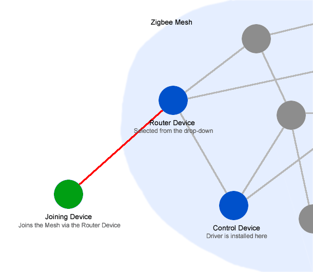
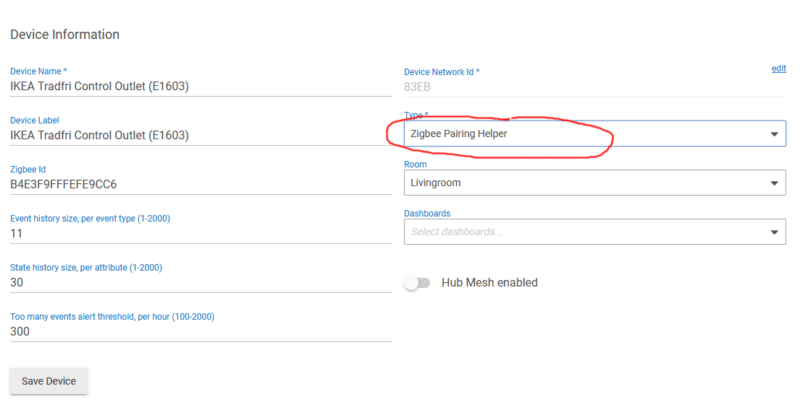
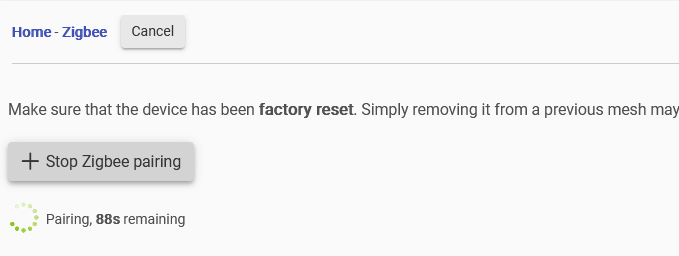
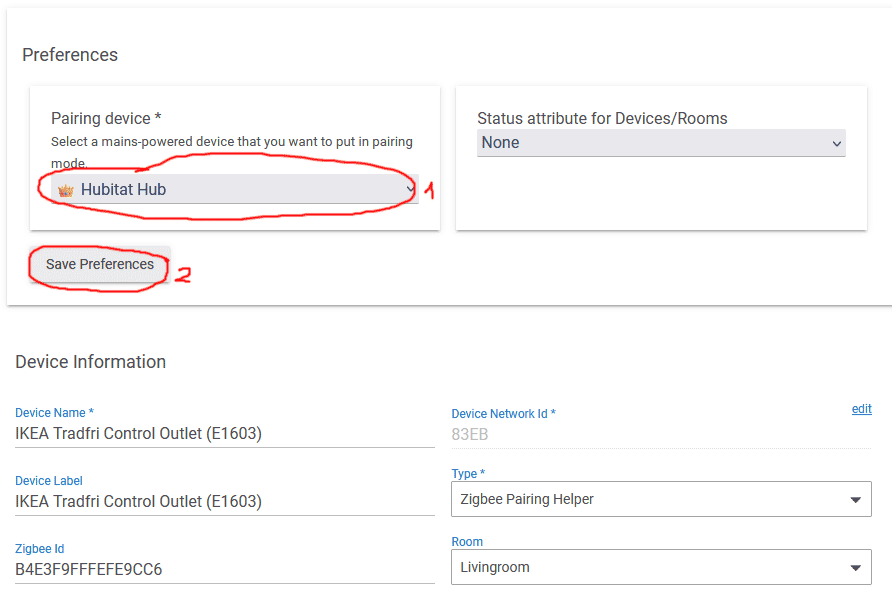
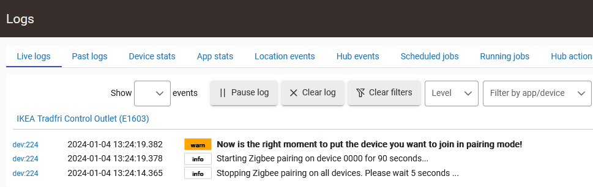
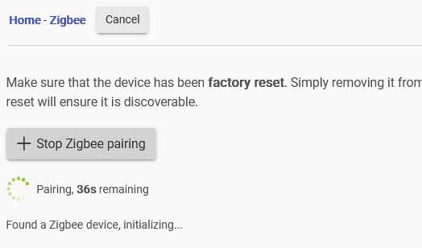
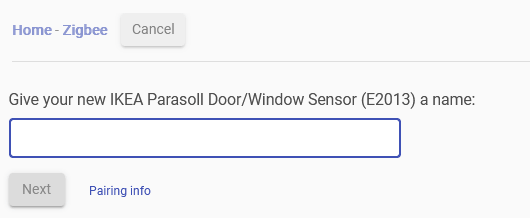

# Zigbee Pairing Helper

This driver allows you to pair a Zigbee device through a specific existing Zigbee router device from the mesh.

## Driver Install

### Install using HPM (offers automatic updates)
Follow the steps below if you already have the "Hubitat Package Manager" app installed in your Hubitat hub:
   1. In the Hubitat interface, go to "Apps" and select "Hubitat Package Manager".
   1. Select "Install", then "Search by Keywords".
   1. Enter "Zigbee Pairing Helper" in the search box and click "Next".
   1. Select "Zigbee Pairing Helper by Dan Danache" and complete the installation process.

### Manual Install
Follow the steps below if you don't know what "Hubitat Package Manager" is:
   1. In the Hubitat interface, go to "Drivers code".
   1. Click "New Driver" in the top right, then Click "Import" in the top right.
   1. Enter the following in the URL field: `https://raw.githubusercontent.com/dan-danache/hubitat/main/zigbee-pairing-helper-driver/zigbee-pairing-helper.groovy`
   1. Click "Import", then click "OK" and the code should load in the editor.
   1. Click "Save" in the top right.

More info about installing custom drivers is available in the [Official Documentation](https://docs2.hubitat.com/en/how-to/install-custom-drivers).

## Join a new device

1. **Goal**
   - We want to add the `Joining Device` to our `Zigbee Mesh` but, we want it to join by using a `Router Device` that we choose.

   **Why?**
   - E.g.: IKEA devices must join the Zigbee mesh only by talking directly to the Hubitat Hub. Otherwise, the pairing process will complete successfully, but the device will leave the mesh shortly after.
   - You may want to join some devices only using Zigbee 3.0 router devices.

   

1. Select a mains-powered Zigbee device and (temporarily) change its driver to "Zigbee Pairing Helper". Best candidates are the Zigbee repeater devices since you can keep using this driver for them. We call this the `Control Device`.

   

   **Note**: This is not the device that the pairing will go through. This device will only send the "start pairing" commands to the target `Router Device` (see below).

1. In a new tab, navigate to (as usual) to "Devices" -> "Add Device" -> "Zigbee" -> "Start Zigbee pairing".

   

   At this moment, all Zigbee router devices in your mesh are in pairing mode, but we do not want this. We want only one specific device to be in pairing mode, so read on.

1. In a new tab, go to the `Control Device` details page and, in the "Preferences" section, select the `Router Device` that you want to put in pairing mode (1), then click the "Save Preferences" button (2).

   

   **Note**: The device you select from the drop-down is the device that the pairing will go through. We call this the `Router Device`.

   **Note**: For IKEA devices, the `Router Device` should be set to "Hubitat Hub".

1. Wait for 5 seconds. Also check the Live Logs for further instructions.

   

   **Note**: Once you click the "Save Preferences" button (see above), the `Control Device` will reset all devices from the pairing mode. Only the `Router Device` that you selected will remain in pairing mode and is able to join other devices into the mesh.

1. Put the `Joining Device` in the pairing mode; for IKEA devices this usually means pushing the pairing button (🔗) 4 times in 5 seconds.

1. The `Joining Device` will be added to the Zigbee network by talking directly to the `Router Device` you selected. Follow the default pairing steps.

   
   

That's all!

---

